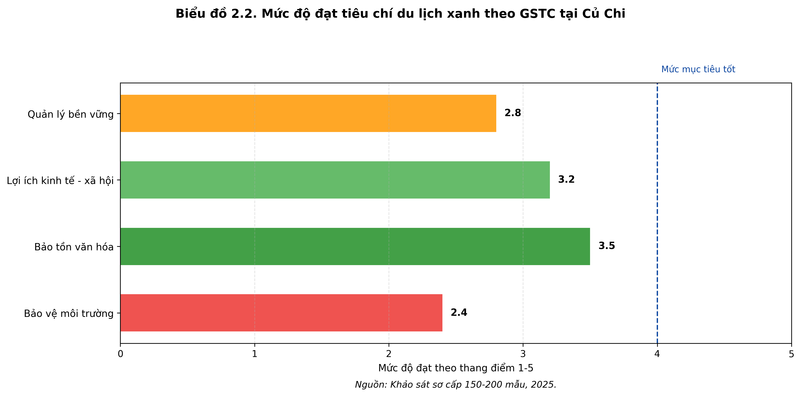

# Bộ 6 hình/biểu đồ minh họa cho đề tài Củ Chi

**Đề tài:** Đánh giá thực trạng phát triển du lịch nông nghiệp theo hướng du lịch xanh tại xã Củ Chi, TP.HCM.

File này dùng để xem nhanh 6 hình/biểu đồ cần chèn vào bài. Mỗi mục bên dưới có vị trí chèn, hình, nguồn và đoạn nhận xét gợi ý.

## Danh sách hình/biểu đồ

| STT | Tên hình/biểu đồ | Vị trí chèn |
|---|---|---|
| 1 | Hình 1.1. Khung phân tích phát triển du lịch nông nghiệp xanh tại xã Củ Chi | Chương 1, sau mục 1.7 |
| 2 | Biểu đồ 2.1. Lượng khách và doanh thu du lịch nông nghiệp tại Củ Chi giai đoạn 2022-6T/2025 | Chương 2, sau Bảng 2.1 |
| 3 | Biểu đồ 2.2. Mức độ đạt tiêu chí du lịch xanh theo GSTC tại Củ Chi | Chương 2, sau Bảng 2.2 |
| 4 | Sơ đồ 2.1. Nguyên nhân gốc rễ khiến du lịch nông nghiệp xanh chưa phát triển tương xứng | Chương 2, mục 2.6 |
| 5 | Hình 3.1. Mô hình phát triển “Củ Chi Green Agri-Tourism Hub” | Chương 3, sau phần mô hình đề xuất |
| 6 | Biểu đồ 3.1. Lộ trình phát triển du lịch nông nghiệp xanh Củ Chi giai đoạn 2026-2030 | Chương 3, sau Bảng 3.2 hoặc cuối mục 3.4 |

---

## 1. Hình 1.1. Khung phân tích phát triển du lịch nông nghiệp xanh tại xã Củ Chi

**Vị trí chèn:** Chương 1, sau mục **1.7. Khung lý thuyết nghiên cứu và khoảng trống nghiên cứu**.

*Nguồn: Tác giả xây dựng, 2026.*

**Nhận xét:**  
Hình 1.1 thể hiện logic phân tích của đề tài, bắt đầu từ cơ sở lý luận về phát triển bền vững, tiêu chí GSTC, SWOT/PESTLE, chuỗi giá trị du lịch và quản trị dịch vụ. Các khung này được sử dụng để đánh giá thực trạng phát triển du lịch nông nghiệp xanh tại xã Củ Chi, từ đó nhận diện tiềm năng, hạn chế, nguyên nhân gốc rễ và đề xuất giải pháp SMART đến năm 2030.

---

## 2. Biểu đồ 2.1. Lượng khách và doanh thu du lịch nông nghiệp tại Củ Chi giai đoạn 2022-6T/2025

**Vị trí chèn:** Chương 2, ngay sau **Bảng 2.1. Thống kê lượng khách và doanh thu du lịch nông nghiệp tại Củ Chi**.

*Nguồn: Tổng hợp từ Sở Du lịch TP.HCM (2025), UBND huyện Củ Chi (2025) và khảo sát sơ cấp của tác giả.*

**Nhận xét:**  
Biểu đồ 2.1 cho thấy lượng khách và doanh thu du lịch nông nghiệp tại Củ Chi có xu hướng tăng trong giai đoạn 2022-2024. Lượng khách tăng từ 45.000 lượt năm 2022 lên 95.000 lượt năm 2024, trong khi doanh thu ước tính tăng từ 85 tỷ đồng lên 210 tỷ đồng. Số liệu 6 tháng đầu năm 2025 đạt 55.000 lượt khách và 135 tỷ đồng, cho thấy dư địa tăng trưởng còn lớn nếu địa phương phát triển sản phẩm xanh bài bản hơn.

---

## 3. Biểu đồ 2.2. Mức độ đạt tiêu chí du lịch xanh theo GSTC tại Củ Chi

**Vị trí chèn:** Chương 2, sau **Bảng 2.2. Đánh giá mức độ đạt tiêu chí du lịch xanh**.

*Nguồn: Khảo sát sơ cấp 150-200 mẫu, 2025.*

**Nhận xét:**  
Biểu đồ 2.2 cho thấy mức độ phát triển theo hướng du lịch xanh tại Củ Chi còn chưa đồng đều. Tiêu chí bảo tồn văn hóa đạt mức khá với 3,5 điểm nhờ khả năng kết hợp với di sản lịch sử Địa đạo Củ Chi. Tuy nhiên, bảo vệ môi trường chỉ đạt 2,4 điểm và quản lý bền vững đạt 2,8 điểm, phản ánh hạn chế về xử lý rác thải, nước thải, quy hoạch dài hạn và giám sát tiêu chí xanh.

---

## 4. Sơ đồ 2.1. Nguyên nhân gốc rễ khiến du lịch nông nghiệp xanh chưa phát triển tương xứng

**Vị trí chèn:** Chương 2, mục **2.6. Phân tích sâu nguyên nhân gốc rễ của các điểm yếu**.

*Nguồn: Tác giả tổng hợp từ phân tích Root Cause tại Chương 2, 2026.*

**Nhận xét:**  
Sơ đồ 2.1 cho thấy các hạn chế của du lịch nông nghiệp xanh tại xã Củ Chi không xuất phát từ một nguyên nhân đơn lẻ, mà từ sự kết hợp của nhiều điểm nghẽn. Nổi bật là quy hoạch xanh chưa cụ thể, hạ tầng xử lý môi trường còn thiếu, nhân lực địa phương chưa được đào tạo chuyên nghiệp, liên kết chuỗi và marketing yếu, cùng với việc thiếu hệ thống giám sát bền vững theo tiêu chí GSTC. Đây là cơ sở để xây dựng nhóm giải pháp tương ứng ở Chương 3.

---

## 5. Hình 3.1. Mô hình phát triển “Củ Chi Green Agri-Tourism Hub”

**Vị trí chèn:** Chương 3, sau đoạn **Mô hình đề xuất: “Củ Chi Green Agri-Tourism Hub”**.

*Nguồn: Tác giả đề xuất, 2026.*

**Nhận xét:**  
Hình 3.1 đề xuất mô hình phát triển du lịch nông nghiệp xanh tại xã Củ Chi theo cấu trúc trung tâm tích hợp. Vòng lõi tập trung vào Địa đạo Củ Chi, nông trại trải nghiệm và canh tác hữu cơ; vòng giữa phát triển homestay xanh, ẩm thực địa phương và sản phẩm OCOP; vòng ngoài kết nối chính quyền, doanh nghiệp lữ hành, cộng đồng và nền tảng Green Hub số. Mô hình này giúp liên kết lợi thế lịch sử với tài nguyên nông nghiệp, đồng thời tạo cơ chế quản trị và marketing thống nhất.

---

## 6. Biểu đồ 3.1. Lộ trình phát triển du lịch nông nghiệp xanh Củ Chi giai đoạn 2026-2030

**Vị trí chèn:** Chương 3, sau **Bảng 3.2. Lộ trình thực hiện chi tiết** hoặc cuối mục **3.4. Lộ trình thực hiện và cơ chế phối hợp**.

*Nguồn: Tác giả tổng hợp từ mục tiêu và lộ trình Chương 3, 2026.*

**Nhận xét:**  
Biểu đồ 3.1 thể hiện lộ trình triển khai giải pháp theo từng mốc từ năm 2026 đến năm 2030. Giai đoạn đầu tập trung hoàn thiện quy hoạch, thành lập ban quản lý, đầu tư hạ tầng xanh và đào tạo nguồn nhân lực. Đến năm 2028, mục tiêu là hình thành 5-7 mô hình thí điểm và đào tạo 300 người dân. Giai đoạn 2029-2030 tập trung mở rộng Green Farm, homestay xanh, OCOP và xây dựng thương hiệu Củ Chi Green Agri-Tourism với mục tiêu 300.000 lượt khách/năm, doanh thu 800-1.000 tỷ đồng và tỷ lệ hài lòng trên 85%.

---

## Ghi chú sử dụng

- Khi chèn vào Word, đặt hình ở giữa trang, caption và nguồn nằm bên dưới hình.
- Không cần thêm nhiều hình hơn 6 hình này, vì các hình đã bao phủ đủ: khung lý luận, thực trạng số liệu, tiêu chí xanh, nguyên nhân gốc rễ, mô hình đề xuất và lộ trình.
- Nếu sửa số liệu trong bài, chạy lại script `dir tôi/scripts/ve_6_hinh_cu_chi.py` để cập nhật toàn bộ ảnh và file Markdown này.
