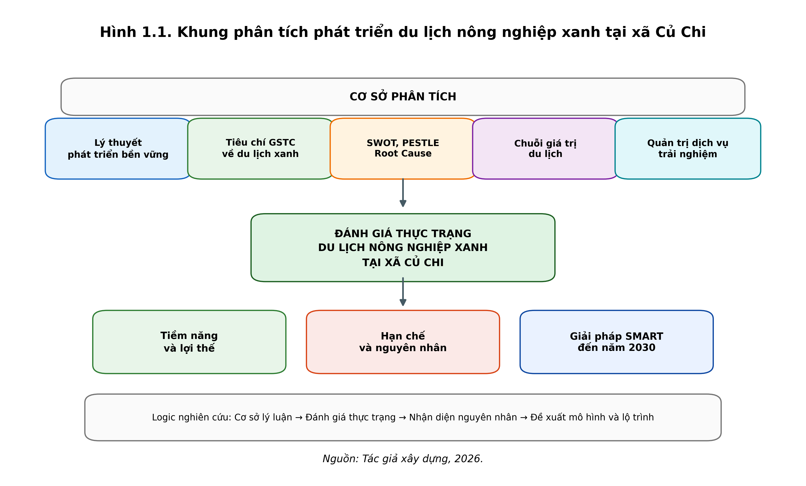
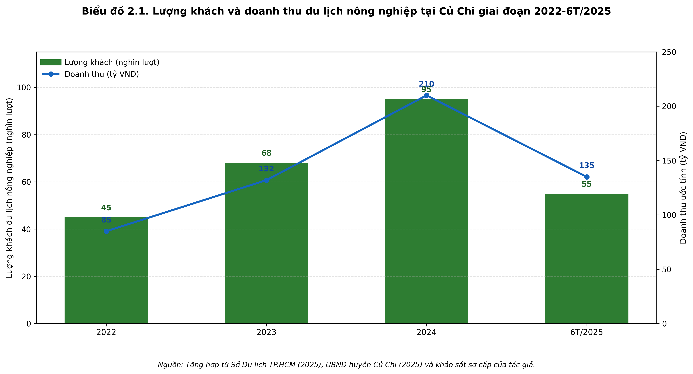
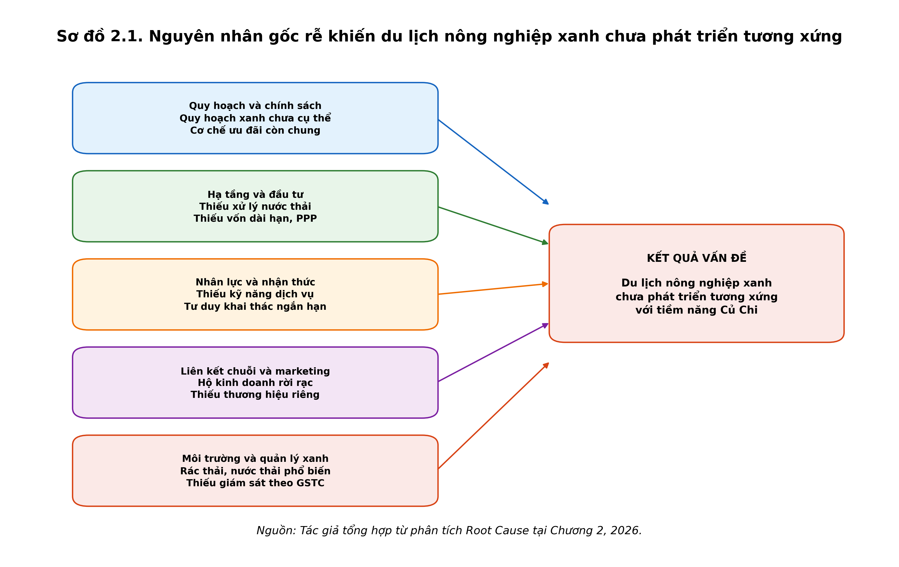
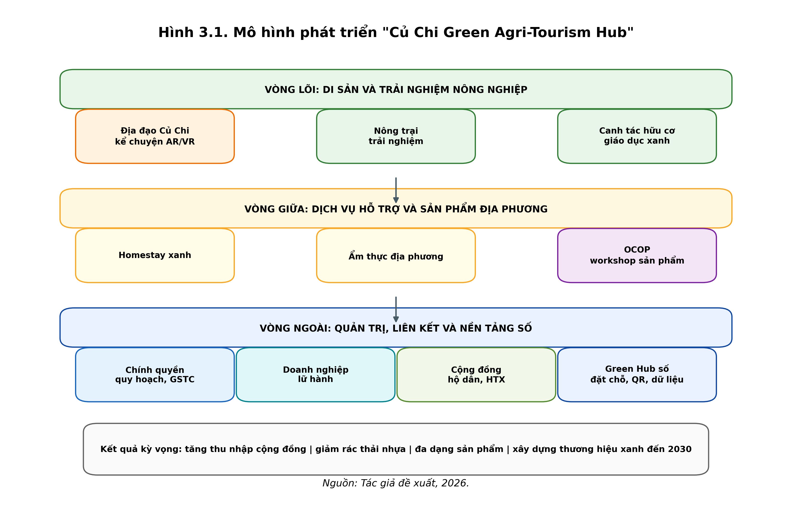
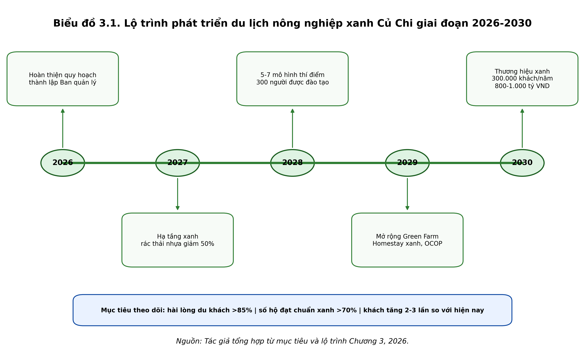

# Đánh giá thực trạng phát triển du lịch nông nghiệp theo hướng du lịch xanh tại xã Củ Chi, TP.HCM

## Báo cáo đề tài / khóa luận tốt nghiệp

**Đơn vị đào tạo:** Trường Đại học Công nghệ TP. Hồ Chí Minh  
**Khoa/Viện:** Quản trị Du lịch - Nhà hàng - Khách sạn  
**Chuyên ngành:** Quản trị dịch vụ du lịch và lữ hành  

---

**Sinh viên thực hiện:** ................................................  
**Mã số sinh viên:** ................................................  
**Lớp:** ................................................  
**Giảng viên hướng dẫn:** ................................................  

---

**Nội dung trọng tâm**

- Đánh giá tiềm năng và thực trạng phát triển du lịch nông nghiệp xanh tại xã Củ Chi.
- Phân tích mức độ khai thác, tiêu chí xanh, điểm mạnh, điểm yếu và nguyên nhân gốc rễ.
- Đề xuất mô hình "Củ Chi Green Agri-Tourism Hub" và lộ trình phát triển đến năm 2030.

---

**TP. Hồ Chí Minh, 2026**

---

---

---

# Nội dung bài luận

---

> Bản Markdown tổng hợp từ các file đã tách trong `dir tôi/markdown/`, kèm 6 hình/biểu đồ minh họa đã tạo.

---

# MỞ ĐẦU

---

## 1.1. Lý do chọn đề tài

Trong bối cảnh cách mạng công nghiệp 4.0 và chuyển đổi xanh toàn cầu, du lịch bền vững, đặc biệt là du lịch xanh và du lịch nông nghiệp, đang trở thành xu hướng chủ đạo của ngành du lịch thế giới. Theo Tổ chức Du lịch Thế giới (UNWTO), du lịch nông thôn và sinh thái dự kiến chiếm khoảng 10% tổng lượng khách du lịch toàn cầu vào năm 2030, góp phần quan trọng vào việc giảm nghèo, bảo vệ môi trường và bảo tồn văn hóa địa phương. Tại Việt Nam, du lịch được xác định là ngành kinh tế mũi nhọn, với Chiến lược phát triển du lịch Việt Nam đến năm 2030, tầm nhìn đến năm 2045, nhấn mạnh định hướng phát triển du lịch xanh, bền vững, gắn với nông nghiệp và nông thôn mới.
TP. Hồ Chí Minh – đầu tàu kinh tế của cả nước – đang nỗ lực đa dạng hóa sản phẩm du lịch, giảm áp lực lên các điểm du lịch truyền thống và thúc đẩy du lịch nông thôn. Huyện Củ Chi, với vị trí cách trung tâm TP khoảng 70 km về phía Tây Bắc, sở hữu lợi thế đặc biệt: hệ thống Địa đạo Củ Chi nổi tiếng thế giới, quỹ đất nông nghiệp lớn (huyện có diện tích đất nông nghiệp đáng kể trong TP), khí hậu thuận lợi, và các làng nghề truyền thống, vườn cây ăn trái. Xã Củ Chi (sau sắp xếp hành chính) là một trong những khu vực trọng tâm với tiềm năng du lịch nông nghiệp sinh thái cao, kết hợp giữa di sản lịch sử và sản xuất nông nghiệp sạch.
Tuy nhiên, khoảng cách giữa tiềm năng và thực tế phát triển vẫn còn lớn. Mặc dù Địa đạo Củ Chi đón hàng trăm nghìn lượt khách mỗi năm (ví dụ: hơn 717.000 lượt khách trong 6 tháng đầu năm 2025, trong đó khách quốc tế chiếm tỷ lệ cao), du lịch nông nghiệp theo hướng xanh tại xã Củ Chi vẫn chủ yếu mang tính tự phát, quy mô nhỏ lẻ. Các mô hình như vườn trái cây Trung An, Nông trang xanh hay các điểm trải nghiệm nông nghiệp chưa tạo được chuỗi giá trị bền vững, thiếu đồng bộ về hạ tầng xanh, quản lý chất thải, và chứng nhận tiêu chuẩn du lịch sinh thái. Doanh thu từ du lịch nông nghiệp chưa tương xứng với tiềm năng, tỷ lệ tham gia của cộng đồng địa phương còn hạn chế, và tác động môi trường (chất thải, sử dụng hóa chất) chưa được kiểm soát chặt chẽ.
Theo các báo cáo gần đây của Sở Du lịch TP.HCM và UBND huyện, du lịch Củ Chi vẫn “độc đạo” ở sản phẩm lịch sử, trong khi du lịch nông nghiệp xanh – xu hướng đang bùng nổ với hơn 600 mô hình trên toàn quốc đến năm 2025 – chưa được khai thác hiệu quả. Điều này dẫn đến nguy cơ bỏ lỡ cơ hội tăng trưởng kinh tế xanh, cải thiện sinh kế nông dân và bảo tồn hệ sinh thái nông nghiệp.
Việc đánh giá thực trạng phát triển du lịch nông nghiệp theo hướng du lịch xanh tại xã Củ Chi là cần thiết cấp bách, nhằm làm rõ nguyên nhân gốc rễ của sự chưa tương xứng, từ đó đề xuất giải pháp khoa học, khả thi, góp phần thực hiện Nghị quyết của TP.HCM về phát triển du lịch nông thôn và nông nghiệp công nghệ cao.

---

## 1.2. Tình hình nghiên cứu trong và ngoài nước

Nghiên cứu ngoài nước: Du lịch nông nghiệp (agritourism) và du lịch xanh đã được nghiên cứu sâu rộng. Các học giả quốc tế như Phillip et al. (2010) định nghĩa agritourism là hoạt động kết hợp sản xuất nông nghiệp với dịch vụ du lịch. UNWTO nhấn mạnh vai trò của rural tourism trong phát triển bền vững, với khung GSTC (Global Sustainable Tourism Council) cung cấp tiêu chí đánh giá du lịch xanh. Nhiều nghiên cứu tại châu Âu (Ý, Pháp), châu Á (Nhật Bản, Thái Lan) phân tích mô hình thành công, sử dụng SWOT/PESTLE và chỉ số đo lường bền vững. Các nghiên cứu gần đây tập trung vào tác động biến đổi khí hậu và chuyển đổi số trong agritourism.
Nghiên cứu trong nước: Tại Việt Nam, các công trình của Nguyễn Văn Hùng, Trần Thị Mai và các tác giả trên Tạp chí Du lịch, Tạp chí Kinh tế & Phát triển đã phân tích du lịch sinh thái, du lịch cộng đồng. Các nghiên cứu cụ thể về du lịch nông nghiệp tại Sa Pa, Đà Lạt, Đồng bằng sông Cửu Long nhấn mạnh giá trị kinh tế - xã hội. Về Củ Chi, có một số công trình như “Phát triển du lịch nông nghiệp trường hợp huyện Củ Chi” (Đồng Phú Hảo, 2023), nhưng chủ yếu dừng ở tổng quan, chưa tập trung sâu vào khía cạnh “du lịch xanh” với phân tích root cause và giải pháp cụ thể tại cấp xã. Chưa có nghiên cứu nào kết hợp khảo sát sơ cấp quy mô lớn, PESTLE/SWOT chi tiết và giải pháp SMART cho xã Củ Chi.

---

## 1.3. Mục tiêu nghiên cứu

Mục tiêu tổng quát: Đánh giá thực trạng phát triển du lịch nông nghiệp theo hướng du lịch xanh tại xã Củ Chi, TP. Hồ Chí Minh, từ đó đề xuất các giải pháp khoa học, khả thi nhằm thúc đẩy phát triển bền vững.
Mục tiêu cụ thể:
- Hệ thống hóa cơ sở lý luận và thực tiễn về du lịch nông nghiệp theo hướng du lịch xanh.
- Phân tích, đánh giá thực trạng phát triển tại xã Củ Chi thông qua các công cụ SWOT, PESTLE và phân tích nguyên nhân gốc rễ.
- Đề xuất hệ thống giải pháp chung và giải pháp sáng tạo cá nhân (có lộ trình, chỉ số SMART) phù hợp với điều kiện địa phương.

---

## 1.4. Đối tượng và phạm vi nghiên cứu

Đối tượng nghiên cứu: Hoạt động phát triển du lịch nông nghiệp theo hướng du lịch xanh (các mô hình, sản phẩm, quản lý, tác động kinh tế - xã hội - môi trường) tại xã Củ Chi.
Phạm vi nghiên cứu:
- Không gian: Xã Củ Chi, huyện Củ Chi, TP. Hồ Chí Minh (tập trung các mô hình nông nghiệp trải nghiệm, vườn trái cây, homestay sinh thái).
- Thời gian: Tập trung giai đoạn 2019–2025 (sau dịch COVID-19 đến nay), định hướng đến 2030.
- Nội dung: Giới hạn ở khía cạnh du lịch xanh (bền vững môi trường, kinh tế cộng đồng, bảo tồn văn hóa).

---

## 1.5. Câu hỏi nghiên cứu

- Thực trạng phát triển du lịch nông nghiệp theo hướng du lịch xanh tại xã Củ Chi như thế nào (mức độ, điểm mạnh/yếu)?
- Các yếu tố PESTLE và nguyên nhân gốc rễ nào đang cản trở sự phát triển tương xứng với tiềm năng?
- Giải pháp nào (chung và cụ thể) cần thiết để thúc đẩy du lịch nông nghiệp xanh bền vững tại địa bàn?

---

## 1.6. Phương pháp nghiên cứu

Khóa luận sử dụng kết hợp phương pháp nghiên cứu định lượng và định tính, trong đó tập trung chính vào phương pháp thu thập dữ liệu sơ cấp thông qua khảo sát bảng hỏi.
- Dữ liệu thứ cấp: Thu thập và phân tích từ các nguồn tài liệu chính thức như báo cáo của Sở Du lịch TP. Hồ Chí Minh, UBND huyện Củ Chi và xã Củ Chi, số liệu thống kê du lịch các năm 2019–2025, các văn bản quy hoạch phát triển du lịch của Thành phố, tài liệu khoa học trong nước và quốc tế từ các tạp chí uy tín, cơ sở dữ liệu UNWTO, GSTC.
- Dữ liệu sơ cấp: Khảo sát bảng hỏi: Thiết kế bảng hỏi có cấu trúc với thang đo Likert 5 mức độ để thu thập ý kiến đánh giá của du khách, người dân và doanh nghiệp địa phương về thực trạng phát triển du lịch nông nghiệp theo hướng du lịch xanh. Dự kiến khảo sát khoảng 150–200 mẫu (phân bổ hợp lý giữa du khách và đối tượng địa phương). Mẫu được chọn theo phương pháp ngẫu nhiên phân tầng. Dữ liệu sau khi thu thập sẽ được xử lý bằng phần mềm SPSS và Excel để phân tích thống kê mô tả, kiểm định độ tin cậy (Cronbach’s Alpha) và các phân tích đa biến cần thiết.
Các phương pháp phân tích được sử dụng bao gồm: SWOT, PESTLE, ma trận đánh giá và phân tích nguyên nhân gốc rễ (Root Cause Analysis). Đảm bảo tính khoa học, khách quan và tuân thủ các nguyên tắc đạo đức nghiên cứu.

---

## 1.7. Ý nghĩa khoa học và thực tiễn

Ý nghĩa khoa học: Bổ sung khung lý thuyết về du lịch nông nghiệp xanh tại vùng chuyển tiếp đô thị - nông thôn; cung cấp mô hình phân tích thực trạng cụ thể cho địa bàn TP.HCM.
Ý nghĩa thực tiễn: Cung cấp cơ sở dữ liệu và giải pháp cho chính quyền xã Củ Chi, huyện Củ Chi và Sở Du lịch TP.HCM trong quy hoạch du lịch xanh; góp phần nâng cao thu nhập cộng đồng, bảo vệ môi trường và đa dạng hóa sản phẩm du lịch TP.HCM. Kết quả nghiên cứu có thể nhân rộng cho các xã nông thôn khác.

---

## 1.8. Cấu trúc khóa luận

Khóa luận gồm 3 chương chính (ngoài phần Mở đầu và Kết luận):
- Chương 1: Cơ sở lý luận và thực tiễn.
- Chương 2: Thực trạng phát triển (phân tích sâu SWOT/PESTLE và root cause).
- Chương 3: Giải pháp và khuyến nghị.

---

# CHƯƠNG 1: CƠ SỞ LÝ LUẬN VÀ KHUNG LÝ THUYẾT

---

## 1.1. Các khái niệm cơ bản

Du lịch nông nghiệp là một trong những hình thức du lịch đang phát triển mạnh mẽ trên thế giới và tại Việt Nam trong bối cảnh chuyển đổi số và phát triển bền vững. Phillip et al. (2010) định nghĩa agritourism như một dạng du lịch nông thôn trong đó du khách tham gia vào các hoạt động liên quan đến môi trường nông nghiệp đang hoạt động, bao gồm cả các trải nghiệm trực tiếp hoặc gián tiếp với sản xuất nông nghiệp. Theo Barbieri và Mshenga (2008), du lịch nông nghiệp là “bất kỳ hoạt động nào được phát triển trên trang trại đang hoạt động với mục đích thu hút du khách”. Tại Việt Nam, Bộ Văn hóa, Thể thao và Du lịch (2023) mô tả du lịch nông nghiệp là loại hình du lịch kết hợp khai thác tài nguyên trang trại, nông thôn, cho phép du khách trải nghiệm sản xuất nông nghiệp, văn hóa làng quê và tiêu dùng sản phẩm địa phương. Tổng hợp từ các quan điểm trên, trong nghiên cứu này, du lịch nông nghiệp được hiểu là hoạt động du lịch dựa trên nền tảng nông nghiệp đang sản xuất, kết hợp trải nghiệm, giáo dục và dịch vụ lưu trú nhằm tạo giá trị kinh tế, xã hội và môi trường cho cộng đồng địa phương.
Du lịch xanh (green tourism) nhấn mạnh việc giảm thiểu tác động tiêu cực đến môi trường và tối đa hóa lợi ích kinh tế - xã hội. Theo UNWTO (2024), du lịch xanh là hình thức du lịch giảm phát thải carbon, bảo vệ đa dạng sinh học và thúc đẩy sử dụng tài nguyên hiệu quả. Global Sustainable Tourism Council (GSTC, 2025) bổ sung rằng du lịch xanh phải tuân thủ bốn trụ cột chính: quản lý bền vững, lợi ích kinh tế - xã hội, bảo tồn văn hóa và bảo vệ môi trường.
Du lịch sinh thái (ecotourism) là một phân nhánh của du lịch xanh, tập trung vào việc bảo tồn thiên nhiên và giáo dục môi trường. TIES (The International Ecotourism Society, 2015) định nghĩa du lịch sinh thái là “du lịch có trách nhiệm với môi trường tự nhiên, bảo tồn hệ sinh thái và cải thiện phúc lợi cộng đồng địa phương”. Tại Việt Nam, Luật Du lịch 2017 coi du lịch sinh thái là hoạt động dựa trên giá trị tự nhiên, góp phần bảo vệ môi trường.
Du lịch bền vững (sustainable tourism) là khái niệm rộng nhất, theo UNWTO và UNEP (2005), là “du lịch đáp ứng nhu cầu của du khách và cộng đồng chủ nhà đồng thời bảo vệ và nâng cao cơ hội cho tương lai”. Nó cân bằng ba trụ cột: kinh tế, xã hội và môi trường.
Du lịch cộng đồng (community-based tourism) nhấn mạnh sự tham gia trực tiếp của người dân địa phương trong quản lý và hưởng lợi từ hoạt động du lịch. Hatton (1999) và nhiều nghiên cứu sau này coi đây là mô hình trao quyền cho cộng đồng, giảm bất bình đẳng và bảo tồn bản sắc văn hóa.
Các khái niệm trên có mối quan hệ chặt chẽ: du lịch nông nghiệp theo hướng du lịch xanh là sự kết hợp giữa du lịch nông nghiệp với các nguyên tắc của du lịch xanh, sinh thái, bền vững và cộng đồng, nhằm tạo ra mô hình phát triển toàn diện tại các khu vực nông thôn như xã Củ Chi.

---

## 1.2. Đặc điểm và tiêu chí đánh giá du lịch nông nghiệp theo hướng du lịch xanh

Du lịch nông nghiệp theo hướng du lịch xanh có những đặc điểm nổi bật: tính trải nghiệm cao, gắn kết với sản xuất thực tế, tính mùa vụ rõ rệt, và phụ thuộc mạnh vào tài nguyên địa phương. Theo GSTC (2025), tiêu chí đánh giá bao gồm bốn nhóm chính.
Về môi trường, hoạt động phải giảm thiểu chất thải, bảo tồn đa dạng sinh học, sử dụng năng lượng tái tạo và quản lý nước hiệu quả. Kinh tế đòi hỏi tạo việc làm địa phương, tăng giá trị chuỗi cung ứng nông sản và phân phối lợi ích công bằng. Về xã hội - văn hóa, mô hình phải tôn trọng bản sắc cộng đồng, thúc đẩy bình đẳng giới và giáo dục du khách về di sản địa phương.
Tại Việt Nam, Bộ Văn hóa, Thể thao và Du lịch (2024) đã ban hành các tiêu chí du lịch nông thôn gắn với tăng trưởng xanh, nhấn mạnh việc áp dụng OCOP (mỗi xã một sản phẩm) và chứng nhận hữu cơ. Những tiêu chí này đặc biệt phù hợp với xã Củ Chi – nơi có tiềm năng kết hợp di sản lịch sử Địa đạo với nông nghiệp sạch, nhưng hiện vẫn tồn tại khoảng cách trong việc áp dụng các tiêu chuẩn xanh.

---

## 1.3. Các mô hình thành công trên thế giới và Việt Nam

Trên thế giới, du lịch nông nghiệp theo hướng xanh đã phát triển đa dạng với nhiều mô hình tiêu biểu.

---

### 1.3.1. Mô hình Agriturismo (Ý)

Agriturismo là mô hình du lịch nông nghiệp đặc trưng của Ý, được pháp lý hóa lần đầu theo Luật khung năm 1985 và tiếp tục được hoàn thiện bằng Luật số 96/2006. Theo quy định hiện hành, Agriturismo là hoạt động tiếp nhận, lưu trú và phục vụ khách do chính các chủ trang trại hoặc doanh nghiệp nông nghiệp thực hiện, dựa trên mối liên kết trực tiếp với hoạt động trồng trọt, chăn nuôi hoặc lâm nghiệp của trang trại Parlamento Italiano.
Điểm cốt lõi của mô hình này là trang trại không chỉ sản xuất nông nghiệp mà còn cung cấp các dịch vụ du lịch như lưu trú, ẩm thực địa phương, tham quan vườn nho, vườn ô liu, trải nghiệm thu hoạch, chế biến thực phẩm, cưỡi ngựa, đi bộ sinh thái hoặc tham gia các lớp học về nông nghiệp. Vì vậy, Agriturismo không đơn thuần là “khách sạn ở nông thôn”, mà là mô hình kết hợp giữa sản xuất nông nghiệp, bảo tồn cảnh quan, văn hóa ẩm thực và trải nghiệm đời sống nông thôn.
Mô hình này hướng đến nhiều mục tiêu: đa dạng hóa thu nhập cho nông dân, giữ dân cư ở lại vùng nông thôn, phục hồi các công trình nông thôn cũ, bảo vệ cảnh quan, phát huy sản phẩm địa phương và truyền thống ẩm thực. Đây cũng là lý do Agriturismo được xem là một dạng phát triển du lịch nông nghiệp bền vững, phù hợp với định hướng phát triển nông thôn của Liên minh châu Âu, trong đó CAP nhấn mạnh việc duy trì sức sống kinh tế - xã hội của khu vực nông thôn European Commission.
Nội dung
Mô tả tóm tắt
Tên mô hình
Agriturismo, du lịch nông nghiệp tại trang trại của Ý
Quốc gia áp dụng
Ý
Cơ sở pháp lý
Luật khung năm 1985, hoàn thiện bởi Luật số 96/2006
Chủ thể vận hành
Chủ trang trại, hộ nông dân, doanh nghiệp nông nghiệp
Không gian tổ chức
Trang trại, nhà nông thôn, vườn nho, vườn ô liu, đồng cỏ, khu chăn nuôi
Dịch vụ chính
Lưu trú, ăn uống, trải nghiệm canh tác, tham quan, giáo dục nông nghiệp, hoạt động sinh thái
Giá trị cốt lõi
Nông nghiệp thật, ẩm thực địa phương, bảo tồn cảnh quan, văn hóa nông thôn
Cơ chế quản lý
Được cấp phép, chịu quản lý theo luật quốc gia và quy định vùng
Công cụ nhận diện chất lượng
Thương hiệu “Agriturismo Italia” và hệ thống phân loại bằng biểu tượng hoa hướng dương từ năm 2013 Agriturismo Italia
Khách hàng mục tiêu
Du khách đô thị, khách quốc tế, gia đình, nhóm học sinh - sinh viên, người thích du lịch xanh và trải nghiệm bản địa

Những điều mô hình đã đạt được là: Agriturismo đã trở thành một ngành du lịch nông thôn có quy mô lớn tại Ý. Năm 2024, Ý có 26.360 cơ sở Agriturismo, tăng 0,9% so với năm 2023; lượng khách đạt 4,7 triệu lượt, tăng 4,3%, trong đó khách quốc tế chiếm 54,8% ISTAT. Điều này cho thấy mô hình không chỉ phục vụ thị trường nội địa mà còn có sức hút mạnh với du khách quốc tế.
Mô hình cũng góp phần đa dạng hóa thu nhập cho nông dân. Thay vì chỉ phụ thuộc vào bán nông sản, các trang trại có thể tạo thêm doanh thu từ phòng nghỉ, nhà hàng, tour trải nghiệm, lớp học nấu ăn, tham quan sản xuất rượu vang, dầu ô liu hoặc phô mai. Bên cạnh đó, Agriturismo giúp bảo tồn nhà cổ nông thôn, cảnh quan canh tác truyền thống và sản phẩm địa phương. Đây là hướng đi phù hợp với hệ thống bảo hộ chỉ dẫn địa lý và sản phẩm chất lượng của EU, vốn nhấn mạnh giá trị nguồn gốc, tính xác thực và di sản ẩm thực European Commission.
Ngoài ra, Agriturismo còn phát triển mạnh mảng giáo dục nông nghiệp. Năm 2024, Ý có 2.340 cơ sở Agriturismo được phép cung cấp dịch vụ “trang trại giáo dục”, chiếm 8,9% tổng số cơ sở; số lượng này tăng 12,2% so với năm 2023 và tăng 220% so với năm 2010 ISTAT. Đây là minh chứng cho việc mô hình không chỉ tạo doanh thu du lịch mà còn góp phần nâng cao nhận thức về nông nghiệp, môi trường và văn hóa thực phẩm.
Hạn chế của mô hình: Tuy đạt nhiều kết quả tích cực, Agriturismo vẫn có một số hạn chế.
Thứ nhất, lợi ích của mô hình chưa phân bổ đồng đều. Nghiên cứu của Sonnino cho rằng Agriturismo trên lý thuyết là chiến lược phát triển bền vững, nhưng trong thực tế chỉ phù hợp hơn với một bộ phận nông hộ có điều kiện về vốn, vị trí, kỹ năng phục vụ và khả năng tiếp cận thị trường Sonnino, 2004.
Thứ hai, hoạt động Agriturismo có sự tập trung không gian khá rõ. Năm 2024, 72% du khách Agriturismo lựa chọn các cơ sở ở miền Trung và Đông Bắc Ý; đồng thời chỉ 382 đô thị, tương đương 7,6% tổng số đô thị, đón tới 42% lượng khách ISTAT. Điều này cho thấy những vùng có cảnh quan đẹp, thương hiệu mạnh và hạ tầng tốt sẽ hưởng lợi nhiều hơn, trong khi các vùng nông thôn yếu thế hơn có thể khó phát triển.
Thứ ba, khi mô hình phát triển mạnh, một số cơ sở có xu hướng thương mại hóa, nâng cấp thành khu nghỉ dưỡng cao cấp, làm giảm tính “nông nghiệp thật”. Nếu dịch vụ lưu trú, hồ bơi, nhà hàng, spa lấn át hoạt động sản xuất nông nghiệp, Agriturismo có nguy cơ trở thành du lịch nghỉ dưỡng nông thôn hơn là du lịch nông nghiệp đúng nghĩa.
Ưu điểm
Nhược điểm
Tạo thêm thu nhập cho nông dân
Cần vốn đầu tư ban đầu khá cao
Gắn du lịch với sản xuất nông nghiệp thật
Không phải nông hộ nào cũng đủ năng lực làm du lịch
Bảo tồn cảnh quan, nhà nông thôn và văn hóa ẩm thực
Dễ tập trung ở vùng đã nổi tiếng, khó lan tỏa đồng đều
Tăng giá trị nông sản địa phương
Có nguy cơ thương mại hóa, mất tính nguyên bản
Thu hút khách quốc tế, nhất là khách thích trải nghiệm xanh
Phụ thuộc vào mùa vụ, thời tiết và xu hướng du lịch
Có hệ thống pháp lý và thương hiệu nhận diện rõ ràng
Quản lý chất lượng phải chặt để tránh “gắn mác” hình thức

Nhận xét cá nhân
Agriturismo là mô hình có giá trị tham khảo lớn đối với phát triển du lịch nông nghiệp xanh tại Củ Chi vì mô hình này không tách du lịch ra khỏi nông nghiệp, mà lấy chính hoạt động sản xuất, cảnh quan và đời sống nông thôn làm tài nguyên du lịch. Điểm đáng học nhất là Ý đã xây dựng được khung pháp lý, tiêu chuẩn nhận diện và cách kết hợp giữa lưu trú, ẩm thực, trải nghiệm canh tác và giáo dục nông nghiệp.
Tuy nhiên, khi vận dụng vào Củ Chi, không nên sao chép hoàn toàn theo kiểu xây khu lưu trú lớn hoặc dịch vụ cao cấp, vì điều kiện vốn, hạ tầng và quy mô nông hộ còn khác biệt. Củ Chi nên học theo hướng vừa sức hơn: phát triển tour tham quan nông trại, trải nghiệm trồng - thu hoạch - chế biến nông sản, kết hợp ẩm thực địa phương, giáo dục môi trường và tiêu chuẩn du lịch xanh. Như vậy, mô hình sẽ giữ được tính chân thật, tạo thêm thu nhập cho người dân và tránh biến du lịch nông nghiệp thành du lịch nghỉ dưỡng hình thức.

---

### 1.3.2. Mô hình Green Tourism (Nhật Bản)

Mô hình du lịch nông nghiệp công nghệ cao tại Đà Lạt là một trong những hình mẫu tiên phong tại Việt Nam, chuyển đổi thành công nền sản xuất nông nghiệp truyền thống sang nông nghiệp hiện đại tích hợp giáo dục và du lịch. Với việc áp dụng các tiêu chuẩn canh tác từ Israel, mô hình này không chỉ đảm bảo năng suất, chất lượng mà còn tạo ra không gian trải nghiệm độc đáo, thu hút mạnh mẽ khách du lịch quốc tế và các đoàn học sinh, sinh viên.
Đặc điểm nổi bật của mô hình là sự hiện diện của hệ thống nhà kính, nhà lưới quy mô lớn, kết hợp với các giải pháp công nghệ IoT (Internet of Things) để tự động hóa quy trình chăm sóc cây trồng (tưới nước, điều tiết ánh sáng, nhiệt độ). Du khách khi tham quan không chỉ được chiêm ngưỡng những "công viên nông nghiệp" sạch sẽ, hiện đại mà còn được học hỏi về quy trình sản xuất thực phẩm thông minh, tham gia vào các hoạt động trải nghiệm "hái tại vườn" và đóng gói sản phẩm ngay tại chỗ.
Mô hình này không đơn thuần là tham quan, mà đã trở thành điểm đến du lịch giáo dục (edutainment) chất lượng cao. Các nông trại công nghệ cao trở thành phòng thí nghiệm sống động, nơi du khách có thể tận mắt chứng kiến sự giao thoa giữa nông nghiệp và khoa học số.

Bảng Tóm Tắt Đặc Điểm Mô Hình
Nội dung
Mô tả tóm tắt

Tên mô hình
Du lịch nông nghiệp công nghệ cao Đà Lạt
Khu vực áp dụng
Đà Lạt (Lâm Đồng)
Công nghệ cốt lõi
Nhà kính chuẩn Israel, IoT, hệ thống điều khiển tự động
Chủ thể vận hành
Các doanh nghiệp nông nghiệp lớn, hợp tác xã hiện đại
Dịch vụ chính
Tham quan nông trại công nghệ cao, du lịch giáo dục (STEM), thu hoạch, mua sắm sản phẩm sạch
Giá trị cốt lõi
Năng suất cao, bền vững, trải nghiệm hiện đại, giáo dục nông nghiệp
Khách hàng mục tiêu
Khách quốc tế, đoàn học sinh/sinh viên, khách đi theo tour chuyên đề

Mô hình đã đạt được gì
Mô hình này đã định hình lại vị thế của nông nghiệp Đà Lạt trên bản đồ du lịch.
Thứ nhất, tối ưu hóa giá trị kinh tế trên cùng một diện tích đất. Công nghệ cho phép canh tác quanh năm với năng suất vượt trội, đồng thời dịch vụ du lịch đi kèm giúp tối đa hóa doanh thu từ sản phẩm nông sản.
Thứ hai, tạo ra môi trường du lịch chuyên nghiệp và sạch sẽ. Hình ảnh các nhà kính hiện đại, quy trình sản xuất sạch hoàn toàn xóa bỏ định kiến về sự vất vả, lam lũ của nông nghiệp truyền thống, dễ dàng tiếp cận khách hàng cao cấp.
Thứ ba, đóng góp tích cực vào giáo dục STEM. Các trang trại trở thành nơi thực hành thực tế cho học sinh về sinh học, vật lý và công nghệ thông tin, tạo ra nguồn doanh thu phi nông nghiệp bền vững.

Hạn chế của mô hình
Dù rất hiện đại, mô hình này vẫn gặp nhiều rào cản.
Thứ nhất, rào cản về vốn đầu tư ban đầu cực lớn. Công nghệ Israel và hệ thống IoT đòi hỏi chi phí lắp đặt, vận hành và bảo trì rất cao, không phải hộ nông dân nào cũng có khả năng tiếp cận.
Thứ hai, nguy cơ phá vỡ cảnh quan tự nhiên. Sự phát triển ồ ạt của các dãy nhà kính trắng có thể ảnh hưởng tiêu cực đến vẻ đẹp cảnh quan đặc trưng của Đà Lạt nếu không có sự quy hoạch khéo léo.
Thứ ba, đòi hỏi trình độ quản lý rất cao. Việc vận hành cả một hệ thống nông nghiệp thông minh và quản lý dịch vụ du lịch đòi hỏi nguồn nhân lực được đào tạo bài bản về cả kỹ thuật lẫn kỹ năng phục vụ.

Bảng So Sánh Ưu - Nhược Điểm
Ưu điểm
Nhược điểm

Năng suất nông nghiệp vượt trội, giảm thiểu rủi ro thiên tai
Chi phí đầu tư công nghệ ban đầu rất cao, rào cản vốn lớn
Trải nghiệm hiện đại, phù hợp khách quốc tế và giáo dục
Có khả năng làm biến đổi cảnh quan tự nhiên đặc trưng
Môi trường tham quan sạch sẽ, chuyên nghiệp
Đòi hỏi nhân lực có trình độ kỹ thuật và quản lý cao

Nhận xét cá nhân
Mô hình nông nghiệp công nghệ cao của Đà Lạt là một "bài học về sự hiện đại hóa" mà Củ Chi có thể cân nhắc. Tuy nhiên, thay vì theo đuổi các nhà kính quy mô cực lớn giống Đà Lạt, Củ Chi có thể tập trung vào "nông nghiệp thông minh quy mô nhỏ" (Smart farming) – nghĩa là áp dụng công nghệ số vào một phần quy trình sản xuất (như hệ thống tưới tự động, quản lý nông sản bằng QR code) để phục vụ mục đích trình diễn và giáo dục.
Củ Chi có thể tận dụng thế mạnh là vùng đệm nông nghiệp cho TP.HCM để phát triển các mô hình "trang trại giáo dục" cho học sinh nội đô. Việc kết hợp nông nghiệp công nghệ cao với giáo dục STEM sẽ thu hút lượng lớn các gia đình đưa con em đi học tập cuối tuần. Điểm mấu chốt là cần tìm được sự cân bằng giữa ứng dụng công nghệ và bảo tồn

---

### 1.3.3. Mô hình OTOP gắn du lịch cộng đồng (Thái Lan)

OTOP (One Tambon One Product - Mỗi xã một sản phẩm) gắn với du lịch cộng đồng là một mô hình phát triển kinh tế nông thôn đặc sắc của Thái Lan. Khởi nguồn từ năm 2001, chương trình OTOP nhằm khuyến khích mỗi cộng đồng (Tambon) phát triển một sản phẩm đặc trưng dựa trên tài nguyên và kỹ năng truyền thống. Khi kết hợp với du lịch, nó đã tạo ra một hệ sinh thái trải nghiệm độc đáo dưới sự hỗ trợ mạnh mẽ của Bộ Du lịch và Thể thao Thái Lan (Ministry of Tourism and Sports Thailand).
Theo cơ chế vận hành, mô hình này không chỉ dừng lại ở việc sản xuất hàng hóa nông nghiệp hay thủ công mỹ nghệ, mà tích hợp trực tiếp không gian sản xuất vào tuyến điểm du lịch. Cư dân địa phương, nghệ nhân và nông dân là những người trực tiếp tiếp đón khách, giới thiệu quy trình làm ra sản phẩm và cung cấp dịch vụ lưu trú homestay ngay tại làng.
Điểm cốt lõi của mô hình là tạo ra một "chuỗi giá trị khép kín". Du khách không chỉ đến tham quan cảnh quan nông thôn mà còn được trải nghiệm trực tiếp quy trình dệt lụa, làm gốm, chế biến nông sản, thưởng thức ẩm thực bản địa và cuối cùng là mua sắm các sản phẩm OTOP chất lượng cao mang về làm quà.
Vì vậy, OTOP kết hợp du lịch cộng đồng mang tính toàn diện cao, vừa đóng vai trò như một đòn bẩy thương mại, vừa là một công cụ bảo tồn di sản văn hóa phi vật thể và các làng nghề truyền thống đang có nguy cơ mai một.
Mô hình này hướng đến mục tiêu then chốt là xóa đói giảm nghèo một cách bền vững. Bằng cách kéo du khách về tận các bản làng, người dân có thể bán sản phẩm trực tiếp với giá trị gia tăng cao hơn, không qua trung gian, đồng thời tạo ra nhiều việc làm tại chỗ (hướng dẫn viên bản địa, phục vụ lưu trú, ẩm thực), giúp giữ chân người trẻ ở lại xây dựng quê hương.

Bảng Tóm Tắt Đặc Điểm Mô Hình
Nội dung
Mô tả tóm tắt

Tên mô hình
OTOP gắn du lịch cộng đồng (Otop Village / CBT)
Quốc gia áp dụng
Thái Lan
Cơ sở chính sách
Chương trình quốc gia OTOP (2001) và chiến lược du lịch nông thôn của chính phủ
Chủ thể vận hành
Cộng đồng dân cư, hợp tác xã, nghệ nhân, doanh nghiệp nhỏ và vừa địa phương
Không gian tổ chức
Làng nghề truyền thống, bản làng nông thôn, không gian văn hóa cộng đồng
Dịch vụ chính
Trải nghiệm làm nghề thủ công/nông nghiệp, mua sắm đặc sản, homestay, ẩm thực địa phương
Giá trị cốt lõi
Chuỗi giá trị khép kín, nâng tầm sản phẩm bản địa, trao quyền cho cộng đồng, giảm nghèo
Cơ chế quản lý
Nhà nước hỗ trợ tiếp thị và đào tạo; Cộng đồng tự chủ vận hành và chia sẻ lợi ích
Công cụ nhận diện chất lượng
Hệ thống xếp hạng OTOP (1-5 sao), Giải thưởng Du lịch Cộng đồng Thái Lan
Khách hàng mục tiêu
Khách du lịch tự túc, nhóm gia đình, khách quốc tế đam mê văn hóa và mua sắm

Mô hình đã đạt được gì
OTOP kết hợp du lịch cộng đồng được đánh giá là một trong những chiến lược kinh tế nông thôn thành công bậc nhất tại Đông Nam Á.
Mô hình này đã tạo ra doanh thu khổng lồ cho khu vực nông thôn Thái Lan. Việc biến các "Làng OTOP" thành điểm đến du lịch giúp các sản phẩm địa phương có thị trường tiêu thụ trực tiếp và ổn định. Du khách sẵn sàng chi trả cao hơn cho một sản phẩm khi họ hiểu được câu chuyện văn hóa và công sức của người nghệ nhân thông qua các tour trải nghiệm.
Mô hình góp phần giảm nghèo hiệu quả và trao quyền cho phụ nữ nông thôn. Rất nhiều hợp tác xã dệt may, làm gốm hay chế biến nông sản tại Thái Lan do phụ nữ làm chủ. Việc phát triển du lịch homestay tại nhà giúp họ vừa chăm sóc gia đình, vừa có thêm nguồn thu nhập độc lập đáng kể.
Bên cạnh đó, mô hình này giúp khôi phục lòng tự hào dân tộc và bảo vệ di sản văn hóa. Những ngành nghề thủ công tưởng chừng bị lãng quên trong thời đại công nghiệp đã hồi sinh mạnh mẽ vì chứng minh được giá trị kinh tế khi gắn với du lịch.
Thái Lan cũng rất xuất sắc trong khâu tiếp thị điểm đến (destination marketing). Họ xây dựng các danh mục "Làng du lịch OTOP" với thiết kế nhận diện thương hiệu chuyên nghiệp, bao bì sản phẩm bắt mắt (đạt chuẩn 3 đến 5 sao) khiến trải nghiệm mua sắm ở nông thôn không hề thua kém các trung tâm thương mại lớn.

Hạn chế của mô hình
Bên cạnh những thành công rực rỡ, việc phát triển ồ ạt mô hình OTOP gắn với du lịch cộng đồng cũng bộc lộ một số nhược điểm cần khắc phục.
Thứ nhất, tính đồng nhất và rập khuôn. Khi phong trào lên cao, nhiều làng đua nhau làm du lịch và sản xuất các sản phẩm tương tự nhau (ví dụ: quá nhiều làng làm xà phòng thảo dược hay khăn lụa), dẫn đến sự cạnh tranh nội bộ gay gắt và làm du khách nhàm chán vì thiếu sự khác biệt.
Thứ hai, nguy cơ thương mại hóa quá mức. Một số làng nghề khi thu hút quá đông khách du lịch đã đánh mất đi tính nguyên bản. Thay vì sản xuất thủ công chân thực, họ nhập hàng công nghiệp về gắn mác OTOP để bán cho khách, hoặc phá vỡ không gian kiến trúc truyền thống để xây dựng các nhà hàng, bãi xe quy mô lớn.
Thứ ba, sự phân bổ nguồn khách không đều. Các làng OTOP nằm gần các trung tâm du lịch lớn như Bangkok, Chiang Mai hay Phuket thu hút lượng khách áp đảo. Ngược lại, các làng ở vùng sâu, thiếu hạ tầng giao thông kết nối lại gặp rất nhiều khó khăn trong việc thu hút khách, dù sản phẩm của họ rất chất lượng.

Bảng So Sánh Ưu - Nhược Điểm
Ưu điểm
Nhược điểm

Tạo chuỗi giá trị khép kín: du khách tham quan, trải nghiệm và tiêu thụ sản phẩm tại chỗ
Dễ dẫn đến tình trạng rập khuôn sản phẩm giữa các địa phương, thiếu điểm nhấn riêng biệt
Xóa đói giảm nghèo hiệu quả, giữ lại tối đa lợi nhuận kinh tế cho cộng đồng bản địa
Nguy cơ thương mại hóa làm mất đi sự chân thật và cảnh quan làng quê truyền thống
Gắn kết chặt chẽ với việc bảo tồn văn hóa, nghề thủ công và kỹ năng truyền thống
Sự phát triển không đồng đều do phụ thuộc vào hạ tầng giao thông và tiếp thị
Hệ thống phân hạng sao kích thích người dân cải tiến chất lượng và bao bì liên tục
Quản lý chất lượng lỏng lẻo có thể dẫn đến việc "trà trộn" hàng hóa công nghiệp kém chất lượng

Nhận xét cá nhân
Việc áp dụng bài học từ mô hình OTOP Thái Lan vào Củ Chi (Việt Nam có chương trình tương đương là OCOP - Mỗi xã một sản phẩm) là một hướng đi vô cùng khả thi và mang tính thực tiễn cao. Củ Chi có sẵn các sản phẩm nông nghiệp và thủ công truyền thống như bánh tráng, đan lát, các loại nông sản sạch, bò sữa, nấm... rất thích hợp để làm hạt nhân cho chuỗi du lịch cộng đồng.
Điểm đáng học hỏi nhất từ Thái Lan là tư duy "kể chuyện sản phẩm" (storytelling) và thiết kế bao bì. Củ Chi cần hỗ trợ các hợp tác xã, hộ nông dân nâng cấp mẫu mã sản phẩm OCOP, biến không gian xưởng sản xuất, trang trại thành các điểm tham quan sạch sẽ, có tính thẩm mỹ và có hoạt động tương tác cho du khách (như tự tay tráng bánh, tự vắt sữa bò, chế biến thảo dược).
Tuy nhiên, khi vận dụng vào Củ Chi, cần rút kinh nghiệm từ điểm hạn chế của Thái Lan bằng cách quy hoạch rõ ràng để tránh "trăm hoa đua nở" nhưng trùng lặp. Mỗi xã ở Củ Chi chỉ nên tập trung chuyên sâu vào một vài dòng sản phẩm thật sự thế mạnh. Việc phát triển lưu trú homestay cũng cần được chuẩn hóa để mang lại sự tiện nghi nhưng phải duy trì được nét văn hóa mộc mạc, gần gũi của người dân Nam Bộ, tuyệt đối tránh việc bê tông hóa nông thôn vì những lợi ích kinh tế trước mắt.

---

### 1.3.4. Mô hình Farm Stay & regenerative agritourism (Mỹ-California & New Zealand)

Farm Stay và Du lịch Nông nghiệp Tái sinh (Regenerative Agritourism) là mô hình du lịch nông nghiệp hiện đại bậc nhất, phổ biến tại các quốc gia như Mỹ (tiêu biểu tại California) và New Zealand. Đây không chỉ là nơi lưu trú đơn thuần mà là một nền tảng thực hành nông nghiệp bền vững, nơi du khách tham gia trực tiếp vào quá trình phục hồi đất đai, hệ sinh thái và ứng dụng công nghệ cao.
Khác với du lịch nông nghiệp truyền thống, mô hình này tập trung vào nông nghiệp tái sinh (Regenerative Agriculture) – phương pháp canh tác giúp cải thiện sức khỏe của đất, tăng đa dạng sinh học và cô lập carbon. Các trang trại không chỉ sản xuất thực phẩm sạch mà còn biến mình thành các trung tâm giáo dục về môi trường, ứng dụng công nghệ trong giám sát tài nguyên và đạt chứng nhận quốc tế từ Hội đồng Du lịch Bền vững Toàn cầu (GSTC).
Điểm cốt lõi của mô hình là sự tích hợp giữa kinh tế và bảo tồn. Trang trại tận dụng các công nghệ số để tối ưu hóa canh tác, đồng thời phát triển các dịch vụ như tham gia đo đạc sức khỏe đất, học về tín chỉ carbon (carbon credits), và trải nghiệm các hệ thống canh tác tích hợp. Du khách khi đến đây được đóng vai trò là những "nhà bảo tồn" tham gia vào các hoạt động tái sinh, tạo nên sợi dây gắn kết sâu sắc với thiên nhiên và trách nhiệm toàn cầu.
Mô hình này không chỉ đa dạng hóa thu nhập cho chủ trang trại thông qua phí lưu trú và các tour giáo dục cao cấp, mà còn tạo ra các dòng doanh thu mới từ dịch vụ môi trường (tín chỉ carbon, dịch vụ hệ sinh thái). Đây được xem là hình mẫu cho sự phát triển nông nghiệp trong tương lai, nơi lợi ích kinh tế song hành cùng việc phục hồi hành tinh.

Bảng Tóm Tắt Đặc Điểm Mô Hình
Nội dung
Mô tả tóm tắt

Tên mô hình
Farm Stay & Regenerative Agritourism
Quốc gia áp dụng
Mỹ (California), New Zealand
Trọng tâm kỹ thuật
Nông nghiệp tái sinh (phục hồi đất, đa dạng sinh học)
Chủ thể vận hành
Doanh nghiệp nông nghiệp công nghệ cao, nông hộ kiểu mới
Không gian tổ chức
Trang trại thông minh, khu bảo tồn sinh thái tư nhân
Dịch vụ chính
Lưu trú nghỉ dưỡng, giáo dục nông nghiệp tái sinh, trải nghiệm công nghệ cao, chứng chỉ carbon
Giá trị cốt lõi
Phục hồi hệ sinh thái, trách nhiệm với khí hậu, công nghệ số, trải nghiệm cao cấp
Cơ chế quản lý
Tuân thủ tiêu chuẩn quốc tế (GSTC), chứng nhận nông nghiệp hữu cơ/tái sinh
Công cụ nhận diện
Chứng chỉ GSTC, báo cáo tác động carbon, nền tảng số kiểm soát chất lượng
Khách hàng mục tiêu
Khách quốc tế, khách cao cấp, nhà đầu tư quan tâm khí hậu, sinh viên khoa học

Mô hình đã đạt được gì
Farm Stay & Regenerative Agritourism đại diện cho thế hệ du lịch nông nghiệp mới, biến nông trại trở thành "trạm nghiên cứu và bảo tồn" mang tầm quốc tế.
Thứ nhất, mô hình đã thành công trong việc tạo ra nguồn thu nhập đa dạng và bền vững. Ngoài doanh thu bán nông sản và lưu trú, các trang trại này thu phí từ các khóa học chuyên sâu, cho thuê không gian nghiên cứu hoặc thậm chí từ việc giao dịch tín chỉ carbon và chi trả dịch vụ hệ sinh thái (PES).
Thứ hai, mô hình đóng góp trực tiếp vào mục tiêu trung hòa carbon và phục hồi đất. Thông qua các phương pháp tái sinh, trang trại trở thành "bể chứa" carbon hiệu quả, được các tổ chức môi trường quốc tế ghi nhận, từ đó nâng cao giá trị thương hiệu và lòng tin của khách hàng.
Thứ ba, việc áp dụng công nghệ cao (IoT, dữ liệu lớn) giúp tối ưu hóa sản xuất và trải nghiệm du khách. Việc theo dõi sức khỏe đất hay lượng carbon qua ứng dụng điện thoại tạo nên trải nghiệm tương tác cực kỳ hiện đại, hấp dẫn nhóm khách trẻ và khách trí thức.
Cuối cùng, chứng nhận GSTC tạo ra "tấm vé thông hành" toàn cầu. Khách du lịch tin tưởng vào tiêu chuẩn bền vững quốc tế, giúp trang trại dễ dàng tiếp cận với lượng khách du lịch toàn cầu thay vì phụ thuộc vào thị trường địa phương.

Hạn chế của mô hình
Đòi hỏi sự đầu tư lớn về vốn, công nghệ và trình độ quản trị là rào cản lớn nhất của mô hình này.
Thứ nhất, chi phí đầu tư hạ tầng công nghệ (IoT, hệ thống cảm biến) và duy trì các chuẩn mực chứng nhận quốc tế rất cao, khiến mô hình khó nhân rộng đối với các nông hộ quy mô nhỏ lẻ.
Thứ hai, mô hình yêu cầu nguồn nhân lực trình độ cao. Nhân viên vận hành không chỉ cần giỏi nông nghiệp mà còn phải hiểu về khoa học môi trường, quản lý dữ liệu và ngoại ngữ để phục vụ khách quốc tế – điều vốn là khó khăn chung của ngành du lịch nông thôn.
Thứ ba, rủi ro về nhận thức của khách hàng. Một bộ phận khách vẫn quen với kiểu trải nghiệm "cưỡi ngựa, hái quả" đơn giản và có thể cảm thấy nhàm chán khi đối mặt với các kiến thức chuyên môn về biến đổi khí hậu hay nông nghiệp tái sinh nếu không được truyền tải một cách khéo léo.

Bảng So Sánh Ưu - Nhược Điểm
Ưu điểm
Nhược điểm

Khả năng thu nhập đa tầng từ sản xuất, dịch vụ du lịch và tín chỉ carbon
Chi phí đầu tư công nghệ và chứng nhận quốc tế rất đắt đỏ, khó triển khai đại trà
Đóng góp trực tiếp vào mục tiêu phục hồi đất đai và giảm thiểu biến đổi khí hậu
Yêu cầu nhân sự có trình độ kỹ thuật và kiến thức về khoa học môi trường cao
Trải nghiệm công nghệ cao thu hút nhóm khách hàng trí thức và khách quốc tế
Nguy cơ bị hiểu nhầm hoặc khó tiếp cận với du khách phổ thông nếu nội dung quá nặng học thuật
Sở hữu thương hiệu uy tín thông qua chứng nhận GSTC toàn cầu
Phụ thuộc vào mức độ nhận thức về môi trường của khách hàng mục tiêu

Nhận xét cá nhân
Theo em, mô hình Regenerative Agritourism là một hình mẫu tương lai cho du lịch nông nghiệp, nhưng việc áp dụng ngay tại Củ Chi sẽ cần một lộ trình bài bản. Với ưu thế là vùng nông nghiệp cận kề đô thị lớn, Củ Chi có thể thử nghiệm mô hình này ở quy mô thí điểm với các trang trại lớn hoặc các khu nông nghiệp công nghệ cao đã hình thành.
Điểm đáng học hỏi nhất chính là tư duy "du lịch trách nhiệm". Chúng ta không nên chỉ bán cảnh quan, mà hãy bán "trải nghiệm tri thức". Thay vì các tour tham quan ngắn, các trang trại tại Củ Chi có thể xây dựng các chương trình "Làm nông tái sinh" kéo dài 3-5 ngày dành cho giới trẻ và khách quốc tế, nơi họ được học về cách cải tạo đất bằng phân hữu cơ, kỹ thuật canh tác không cày xới và tham gia đo lường các chỉ số môi trường bằng công nghệ số.
Về thách thức nhân lực, Củ Chi có lợi thế là gần TP.HCM – nơi tập trung các trường đại học nông nghiệp và môi trường. Chúng ta nên tạo cơ chế liên kết, khuyến khích sinh viên thực tập hoặc các startup công nghệ nông nghiệp đến thử nghiệm, vận hành và quảng bá mô hình. Để tránh sự xa cách với du khách phổ thông, nội dung giáo dục cần được "game hóa" (gamification) – ví dụ như tích điểm bảo vệ môi trường, thi tài làm vườn tái sinh – để vừa mang tính giáo dục, vừa đảm bảo tính giải trí. Đây sẽ là hướng đi giúp Củ Chi khẳng định đẳng cấp du lịch nông nghiệp bền vững, khác biệt hoàn toàn với các mô hình tham quan thuần túy.

Tại Việt Nam, đã xuất hiện nhiều mô hình đáng chú ý:

---

### 1.3.5. Mô hình Làng rau Trà Quế (Quảng Nam)

Mô hình Làng rau Trà Quế (Quảng Nam, Việt Nam)
Làng rau Trà Quế là mô hình du lịch canh tác (farming tourism) tiêu biểu của Việt Nam, đã khẳng định được vị thế quốc tế khi được UN Tourism vinh danh là "Làng Du lịch tốt nhất thế giới" năm 2024. Mô hình này dựa trên nền tảng sản xuất rau hữu cơ truyền thống kết hợp với các hoạt động trải nghiệm du lịch cộng đồng, giúp chuyển đổi giá trị từ sản phẩm nông nghiệp đơn thuần sang dịch vụ du lịch trải nghiệm cao cấp.
Tại Trà Quế, du khách không chỉ đến tham quan mà còn trực tiếp trở thành những "nông dân thực thụ". Họ tham gia vào mọi khâu sản xuất từ gieo hạt, bón phân bằng rong tảo sông, tưới nước bằng gàu thủ công cho đến thu hoạch rau và trực tiếp chế biến các món ăn đặc sản địa phương (như món Tam Hữu). Chính sự chân thực trong đời sống làng quê, kết hợp với các hoạt động giáo dục về nông nghiệp hữu cơ đã tạo nên sức hấp dẫn khó cưỡng cho điểm đến này.
Điểm cốt lõi của mô hình là sự gắn kết chặt chẽ giữa cộng đồng dân cư và du lịch bền vững. Người dân Trà Quế không chỉ là nông dân mà còn là những hướng dẫn viên du lịch thân thiện, am hiểu văn hóa. Lợi nhuận từ hoạt động du lịch được quay trở lại đầu tư cho sản xuất nông nghiệp sạch, bảo tồn hệ sinh thái, đồng thời nâng cao đời sống của người dân địa phương.
Đây là minh chứng rõ nét cho việc lấy sản phẩm nông nghiệp địa phương làm "hồn cốt" của du lịch. Mô hình không chỉ tạo ra thu nhập ổn định cho người dân, giảm áp lực di cư ra đô thị, mà còn bảo vệ được cảnh quan thiên nhiên và lưu giữ những giá trị văn hóa nông nghiệp lâu đời của vùng đất Quảng Nam.

Bảng Tóm Tắt Đặc Điểm Mô Hình
Nội dung
Mô tả tóm tắt

Tên mô hình
Làng rau Trà Quế (Du lịch canh tác)
Quốc gia áp dụng
Việt Nam (Quảng Nam)
Cơ sở vinh danh
"Làng Du lịch tốt nhất thế giới" (UN Tourism, 2024)
Chủ thể vận hành
Cộng đồng cư dân làng rau, các tổ nhóm du lịch địa phương
Không gian tổ chức
Vùng canh tác rau hữu cơ truyền thống cạnh Hội An
Dịch vụ chính
Trải nghiệm trồng rau, ẩm thực nông thôn, homestay, tour văn hóa
Giá trị cốt lõi
Canh tác hữu cơ bền vững, gắn kết nông nghiệp với trải nghiệm thực tế, bảo tồn văn hóa
Cơ chế quản lý
Cộng đồng tự quản, chính quyền địa phương hỗ trợ quy hoạch và quảng bá
Công cụ nhận diện
Thương hiệu nông sản sạch, chứng nhận quốc tế từ UN Tourism
Khách hàng mục tiêu
Khách quốc tế, khách gia đình, nhóm du khách tìm kiếm sự bền vững

Mô hình đã đạt được gì
Làng rau Trà Quế đã biến mình từ một vùng canh tác nhỏ lẻ thành một điểm đến du lịch toàn cầu, mang lại lợi ích kép về kinh tế và xã hội.
Thứ nhất, mô hình tạo ra thu nhập cao và ổn định cho người dân địa phương. Việc kết hợp nông nghiệp và dịch vụ du lịch giúp đa dạng hóa nguồn thu, giảm sự phụ thuộc vào biến động giá cả nông sản. Thu nhập bình quân của người dân làng rau đã tăng đáng kể so với việc chỉ canh tác nông nghiệp truyền thống.
Thứ hai, làng rau đã trở thành hình mẫu về bảo tồn hệ sinh thái. Phương pháp canh tác truyền thống (sử dụng rong tảo, không dùng hóa chất) được duy trì, bảo vệ được đất đai và môi trường nước tại khu vực, đồng thời tạo ra cảnh quan xanh đẹp mắt, thu hút khách du lịch.
Thứ ba, sự thành công của Trà Quế góp phần quan trọng vào việc giữ gìn và quảng bá di sản văn hóa. Những câu chuyện về phương pháp trồng rau, ẩm thực truyền thống được truyền tải trực tiếp đến khách du lịch, giúp giá trị văn hóa làng quê lan tỏa mạnh mẽ.
Vinh danh từ UN Tourism năm 2024 không chỉ là sự công nhận về mặt truyền thông mà còn mở ra cơ hội để Trà Quế tiếp cận các tiêu chuẩn quốc tế cao hơn về du lịch bền vững và quản lý điểm đến.

Hạn chế của mô hình
Dù thành công, làng rau Trà Quế cũng đối mặt với những thách thức trong bối cảnh du lịch phát triển quá nhanh.
Thứ nhất, áp lực từ lượng khách du lịch quá đông vào những mùa cao điểm có thể làm ảnh hưởng đến không gian yên bình và môi trường cảnh quan của làng rau.
Thứ hai, nguy cơ thương mại hóa dần hiện hữu. Để đáp ứng nhu cầu du khách, các dịch vụ ăn theo có thể phá vỡ cảnh quan làng quê truyền thống nếu không được quy hoạch kỹ lưỡng.
Thứ ba, việc kế thừa và duy trì lực lượng lao động trẻ tại làng cũng là một bài toán khó. Nhiều thanh niên trẻ xu hướng tìm đến các công việc tại đô thị thay vì ở lại canh tác và làm dịch vụ du lịch tại quê hương.

Bảng So Sánh Ưu - Nhược Điểm
Ưu điểm
Nhược điểm

Gắn kết sâu sắc nông nghiệp với du lịch, tạo giá trị kinh tế bền vững cho người dân
Áp lực quá tải từ lượng khách đông vào mùa cao điểm gây ảnh hưởng đến không gian sống
Bảo tồn được môi trường, hệ sinh thái canh tác hữu cơ và truyền thống làng nghề
Nguy cơ bị thương mại hóa làm mất đi sự tĩnh lặng và tính nguyên bản vốn có
Xây dựng được thương hiệu điểm đến quốc tế, khẳng định uy tín với khách hàng
Khó khăn trong việc giữ chân thế hệ trẻ kế thừa nghề nông nghiệp truyền thống
Tạo cơ hội giao lưu văn hóa giữa cộng đồng bản địa và du khách quốc tế
Cần sự đầu tư đồng bộ về cơ sở hạ tầng để tránh quá tải khi phát triển quy mô

Nhận xét cá nhân
Làng rau Trà Quế là một minh chứng sống động rằng mô hình nông nghiệp địa phương hoàn toàn có thể trở thành "ngôi sao" trên bản đồ du lịch thế giới nếu được tổ chức bài bản. Đối với Củ Chi, mô hình này là nguồn cảm hứng trực tiếp để phát triển các làng nghề, vườn cây ăn trái, hoặc các trang trại rau hữu cơ thành các điểm đến hấp dẫn tương tự.
Điểm đáng học hỏi nhất của Trà Quế chính là "tính chân thật". Người nông dân ở đó không diễn, họ làm công việc hàng ngày của họ và du khách được quan sát, được tham gia vào chính quá trình đó. Củ Chi có rất nhiều nông trại, vườn tược phong phú, nếu chúng ta có thể kết nối được các hộ nông dân, xây dựng được một quy trình đón khách chuyên nghiệp và giữ gìn được cảnh quan môi trường trong lành, thì việc tạo ra một "phiên bản Trà Quế" tại Củ Chi là hoàn toàn khả thi.
Điều quan trọng nhất là phải đảm bảo được lợi ích kinh tế cho người dân đi đôi với việc bảo vệ môi trường. Không để du lịch làm hỏng môi trường nông nghiệp - nơi vốn là nguồn sống của chính cộng đồng đó. Nếu làm tốt, Củ Chi không chỉ đón khách du lịch mà còn giữ được bản sắc văn hóa nông nghiệp đặc trưng, tạo nên giá trị di sản cho thế hệ tương lai.

---

### 1.3.6. Mô hình Du lịch cộng đồng Thiềng Liềng (Cần Giờ, TP.HCM)

Du lịch cộng đồng Thiềng Liềng là mô hình du lịch sinh thái đặc thù, tọa lạc tại xã đảo Thạnh An, huyện Cần Giờ, TP.HCM. Đây là mô hình tiêu biểu cho phát triển du lịch gắn liền với bảo tồn hệ sinh thái rừng ngập mặn và văn hóa đặc trưng của cư dân vùng ven biển. Dưới sự hỗ trợ của Sở Du lịch TP.HCM (2025), mô hình này đã khẳng định được sức hút nhờ tính nguyên bản và sự tham gia trực tiếp của cộng đồng.
Thiềng Liềng không có xe máy, không có những tòa nhà cao tầng, mà chỉ có những con đường nhỏ, những vườn cây trái, cánh đồng muối và hệ thống rừng ngập mặn bao quanh. Du khách đến đây được trải nghiệm đời sống thuần khiết của người dân làng chài, từ nghề làm muối truyền thống, bắt hải sản, cho đến việc lắng nghe những làn điệu đờn ca tài tử giữa khung cảnh thiên nhiên hoang sơ.
Điểm cốt lõi của mô hình là sự quản lý và vận hành hoàn toàn bởi người dân địa phương. Thông qua các tổ hợp tác du lịch, người dân tự thiết kế các sản phẩm: homestay trong chính ngôi nhà của mình, các dịch vụ trải nghiệm văn hóa, ẩm thực hải sản tươi sống và hoạt động giáo dục môi trường như tìm hiểu về hệ sinh thái rừng ngập mặn Cần Giờ - Khu dự trữ sinh quyển thế giới.
Mô hình hướng tới mục tiêu phát triển bền vững: tạo sinh kế ổn định cho cư dân trên đảo, khuyến khích họ bảo vệ tài nguyên thiên nhiên (vì đó chính là "nguồn sống" du lịch của họ), đồng thời mang đến một không gian trải nghiệm "chữa lành" và học tập thực tế cho du khách, đặc biệt là cư dân từ đô thị lớn như TP.HCM.

Bảng Tóm Tắt Đặc Điểm Mô Hình
Nội dung
Mô tả tóm tắt

Tên mô hình
Du lịch cộng đồng Thiềng Liềng (Cần Giờ)
Địa phương
TP.HCM, Việt Nam
Cơ sở hỗ trợ
Sở Du lịch TP.HCM và chính quyền huyện Cần Giờ
Chủ thể vận hành
Cộng đồng cư dân địa phương, các hộ làm du lịch homestay
Không gian tổ chức
Xã đảo, vùng đệm khu dự trữ sinh quyển rừng ngập mặn
Dịch vụ chính
Homestay, tham quan nghề muối, trải nghiệm rừng ngập mặn, đờn ca tài tử, ẩm thực địa phương
Giá trị cốt lõi
Phát triển dựa vào cộng đồng, bảo tồn thiên nhiên, văn hóa đặc thù vùng ven biển
Cơ chế quản lý
Cộng đồng tự quản với sự định hướng của Sở Du lịch TP.HCM
Công cụ nhận diện
Sản phẩm du lịch đặc trưng (OCOP), chứng nhận điểm đến cộng đồng
Khách hàng mục tiêu
Khách du lịch nội địa, học sinh/sinh viên tham quan, khách tìm kiếm sự tĩnh lặng

Mô hình đã đạt được gì
Thiềng Liềng đã thực sự thay đổi vị thế từ một ấp đảo nghèo, biệt lập thành một điểm sáng du lịch sinh thái của TP.HCM.
Mô hình đã giải quyết bài toán sinh kế bền vững. Trước đây người dân chủ yếu phụ thuộc vào làm muối hoặc đánh bắt gần bờ, thu nhập bấp bênh. Hiện nay, thông qua việc kinh doanh homestay và các tour trải nghiệm, người dân có nguồn thu nhập ổn định hơn, đồng thời không phải rời bỏ quê hương để lên thành phố làm việc.
Về mặt xã hội, sự đoàn kết trong cộng đồng được nâng cao rõ rệt. Người dân chủ động tham gia vào việc cải tạo cảnh quan, làm sạch bãi biển, bảo tồn các làn điệu nghệ thuật truyền thống để làm "vốn" cho du lịch. Sự thành công này còn giúp nâng cao nhận thức của người dân về giá trị của rừng ngập mặn đối với cuộc sống của chính mình.
Đây là minh chứng cho việc nếu biết khai thác đúng cách, không gian nông thôn/hải đảo hoàn toàn có thể trở thành "mỏ vàng" du lịch mà không cần phải bê tông hóa hay thay đổi cấu trúc vốn có.

Hạn chế của mô hình
Dù thành công trong việc giữ tính nguyên bản, mô hình này vẫn gặp nhiều thách thức về hạ tầng và phát triển quy mô.
Đầu tiên là vấn đề kết nối giao thông. Thiềng Liềng nằm ở vị trí cô lập, việc tiếp cận phụ thuộc hoàn toàn vào tàu thuyền. Nếu thời tiết xấu hoặc phương tiện vận tải không đáp ứng đủ, lượng khách du lịch sẽ bị ảnh hưởng nghiêm trọng.
Thứ hai, hạ tầng phục vụ du lịch còn thiếu đồng bộ. Hệ thống cung cấp điện, nước ngọt và vệ sinh môi trường trên đảo vẫn là thách thức lớn khi lượng khách tăng lên, đòi hỏi sự đầu tư công lớn từ thành phố.
Cuối cùng, tính mùa vụ cao. Du lịch tại Thiềng Liềng chịu ảnh hưởng trực tiếp từ yếu tố thiên nhiên. Vào mùa mưa hoặc mùa bão, lượng khách gần như bằng không, khiến doanh thu của người dân không ổn định cả năm.

Bảng So Sánh Ưu - Nhược Điểm
Ưu điểm
Nhược điểm

Tính nguyên bản cao, trải nghiệm độc đáo, gắn kết chặt chẽ với văn hóa địa phương
Vị trí địa lý biệt lập, khó tiếp cận, phụ thuộc vào tàu thuyền
Phát triển sinh kế bền vững cho người dân tại chỗ, giữ chân lao động trẻ
Hạ tầng dịch vụ (điện, nước, vệ sinh) còn yếu, khó đáp ứng khách quy mô lớn
Gắn kết bảo tồn thiên nhiên và giáo dục môi trường một cách trực quan
Phụ thuộc nhiều vào yếu tố thời tiết và tính mùa vụ của du lịch
Sự đồng lòng và làm chủ của cộng đồng trong mọi khâu vận hành
Khả năng mở rộng quy mô hạn chế để tránh làm hỏng hệ sinh thái đảo

Nhận xét cá nhân
Thiềng Liềng là hình mẫu điển hình cho phát triển du lịch tại các vùng địa lý đặc biệt. Khi áp dụng vào tư duy phát triển du lịch nông nghiệp tại Củ Chi, bài học lớn nhất chính là "cộng đồng là trung tâm". Ở Củ Chi, chúng ta có thể khai thác mô hình này ở các khu vực ven sông Sài Gòn hoặc các vùng nông thôn hẻo lánh hơn một chút, nơi có những vườn cây ăn trái, đồng ruộng hoặc các di tích lịch sử nằm xen kẽ với làng quê.
Điều em thấy ấn tượng là cách Thiềng Liềng không cố gắng trở thành một "đô thị du lịch" mà giữ vững vị thế là một "làng đảo yên bình". Củ Chi nên học hỏi cách tiếp cận này: tôn trọng không gian bản địa, tận dụng tài nguyên thiên nhiên vốn có và chỉ bổ sung những dịch vụ thật sự cần thiết. Thay vì tập trung quá nhiều vào cơ sở vật chất hoành tráng, hãy đầu tư vào "nội dung trải nghiệm" (như kể chuyện, dạy làm nghề, hướng dẫn bảo vệ môi trường).
Tuy nhiên, Củ Chi cần khắc phục bài học về giao thông của Thiềng Liềng. Với vị thế kết nối đường bộ thuận tiện hơn nhiều, nếu kết hợp thêm các tuyến bus đường sông hoặc dịch vụ di chuyển xanh tại chỗ, Củ Chi sẽ khắc phục được nhược điểm về tiếp cận và dễ dàng lan tỏa mô hình du lịch cộng đồng hơn rất nhiều. Chìa khóa vẫn là làm sao để người dân thấy được giá trị của việc bảo tồn văn hóa và môi trường chính là cách tốt nhất để làm giàu bền vững.

---

### 1.3.7. Mô hình Vườn trái cây và du lịch sinh thái các tỉnh Đồng bằng sông Cửu Long

Mô hình Vườn trái cây và du lịch sinh thái ĐBSCL
Mô hình du lịch vườn trái cây và sinh thái tại Đồng bằng sông Cửu Long (ĐBSCL) là một trong những loại hình du lịch nông nghiệp phổ biến và thành công nhất tại Việt Nam. Điển hình như các vườn chôm chôm, sầu riêng ở Tiền Giang, Đồng Tháp hay hệ sinh thái tại Vườn quốc gia Tràm Chim, mô hình này đã chuyển đổi tư duy từ sản xuất thuần túy sang kết hợp dịch vụ trải nghiệm, mang lại giá trị gia tăng cao cho nông hộ.
Cốt lõi của mô hình là trải nghiệm "tại vườn": du khách được trực tiếp tham quan vườn cây, tự tay hái và thưởng thức trái cây chín ngay tại gốc. Kết hợp với đó là các dịch vụ lưu trú homestay miệt vườn, chèo xuồng, tham gia các hoạt động đời sống sông nước và tiêu thụ các sản phẩm OCOP (Mỗi xã một sản phẩm) đặc trưng của địa phương.
Mô hình tạo ra chuỗi giá trị tích hợp: nông dân không chỉ bán nông sản với giá thị trường mà còn bán "câu chuyện" và "trải nghiệm". Điều này giúp nông hộ đa dạng hóa nguồn thu nhập, ổn định kinh tế và tạo động lực để họ chăm sóc vườn cây theo hướng sạch, bền vững hơn nhằm giữ chân khách du lịch.

Bảng Tóm Tắt Đặc Điểm Mô Hình
Nội dung
Mô tả tóm tắt

Tên mô hình
Du lịch vườn trái cây và sinh thái ĐBSCL
Khu vực áp dụng
Tiền Giang, Đồng Tháp, các tỉnh miền Tây
Trọng tâm trải nghiệm
Hái trái cây tại vườn, trải nghiệm sông nước, lưu trú homestay
Chủ thể vận hành
Hộ nông dân, các nhóm hộ liên kết, hợp tác xã du lịch
Không gian tổ chức
Vườn cây ăn trái, hệ sinh thái đất ngập nước, kênh rạch
Dịch vụ chính
Tham quan/thu hoạch trái cây, ăn uống miệt vườn, homestay, trải nghiệm OCOP
Giá trị cốt lõi
Đa dạng hóa thu nhập nông hộ, quảng bá nông sản sạch, bảo tồn lối sống miệt vườn
Khách hàng mục tiêu
Khách gia đình, nhóm du khách tìm kiếm sự thư giãn, tour nghỉ dưỡng cuối tuần

Mô hình đã đạt được gì
Mô hình này đã tạo ra bước ngoặt trong tư duy kinh tế nông thôn tại miền Tây.
Thứ nhất, tăng thu nhập đáng kể cho nông hộ. Việc bán trái cây "trên cành" cho khách du lịch mang lại giá trị cao hơn nhiều so với bán buôn qua thương lái. Ngoài ra, dịch vụ homestay và ăn uống tạo thêm dòng doanh thu phụ trợ quan trọng.
Thứ hai, mô hình giúp bảo tồn giống cây trái truyền thống và cảnh quan sông nước. Nhu cầu du lịch thúc đẩy người dân giữ gìn không gian vườn tược thay vì chuyển đổi sang mục đích khác.
Thứ ba, gắn kết với OCOP. Các sản phẩm đặc sản địa phương (mứt, nước ép, đồ thủ công) được tiêu thụ mạnh tại chỗ, góp phần khẳng định thương hiệu và uy tín nông sản vùng miền.

Hạn chế của mô hình
Dù thành công nhưng mô hình vẫn đối mặt với những thách thức đáng kể.
Thứ nhất, tính mùa vụ khắc nghiệt. Du lịch vườn trái cây phụ thuộc hoàn toàn vào chu kỳ thu hoạch. Nếu trái cây hết mùa, khách sẽ thưa vắng, tạo ra áp lực kinh tế cho nông hộ.
Thứ hai, sự cạnh tranh không lành mạnh và rập khuôn. Nhiều vườn đua nhau mở cửa dẫn đến sự tương đồng về dịch vụ, thiếu tính chuyên nghiệp trong quản lý, gây ấn tượng không tốt cho khách.
Thứ ba, hạ tầng giao thông nông thôn đôi khi quá tải hoặc khó tiếp cận với các đoàn khách lớn, hạn chế tiềm năng tăng trưởng quy mô.

Bảng So Sánh Ưu - Nhược Điểm
Ưu điểm
Nhược điểm

Đa dạng hóa nguồn thu nhập cho nông hộ, giảm phụ thuộc thương lái
Tính mùa vụ cao, doanh thu bấp bênh khi trái mùa
Thúc đẩy tiêu thụ các sản phẩm OCOP tại chỗ hiệu quả
Dịch vụ dễ bị rập khuôn, thiếu sự sáng tạo riêng biệt
Bảo tồn được không gian miệt vườn và giống cây trái đặc trưng
Quản lý vệ sinh và cảnh quan còn lỏng lẻo khi lượng khách tăng đột biến

Nhận xét cá nhân
Mô hình du lịch vườn trái cây ĐBSCL là một gợi ý trực tiếp và khả thi cho Củ Chi. Với lợi thế vườn tược đa dạng, Củ Chi có thể học hỏi cách miền Tây "đóng gói" trải nghiệm du lịch. Tuy nhiên, thay vì chỉ làm du lịch theo mùa, Củ Chi có thể tập trung vào mô hình vườn cây đa canh hoặc kết hợp các hoạt động nông nghiệp khác để duy trì dịch vụ quanh năm.
Đặc biệt, việc gắn kết với sản phẩm OCOP là chìa khóa để giữ chân du khách. Củ Chi cần nâng cao chất lượng bao bì và câu chuyện truyền thông cho các sản phẩm từ nông trại (như trà lá sen, sản phẩm từ bò sữa, rau quả VietGAP). Nếu tổ chức được mạng lưới liên kết giữa các nhà vườn để tạo ra các "tuyến đường trải nghiệm" chuyên biệt, Củ Chi chắc chắn sẽ có sức hút mạnh mẽ với du khách nội đô TP.HCM.

---

### 1.3.8. Mô hình Du lịch nông nghiệp công nghệ cao Đà Lạt (Lâm Đồng)

Mô hình Du lịch nông nghiệp công nghệ cao Đà Lạt (Lâm Đồng)
Mô hình du lịch nông nghiệp công nghệ cao tại Đà Lạt là một trong những hình mẫu tiên phong tại Việt Nam, chuyển đổi thành công nền sản xuất nông nghiệp truyền thống sang nông nghiệp hiện đại tích hợp giáo dục và du lịch. Với việc áp dụng các tiêu chuẩn canh tác từ Israel, mô hình này không chỉ đảm bảo năng suất, chất lượng mà còn tạo ra không gian trải nghiệm độc đáo, thu hút mạnh mẽ khách du lịch quốc tế và các đoàn học sinh, sinh viên.
Đặc điểm nổi bật của mô hình là sự hiện diện của hệ thống nhà kính, nhà lưới quy mô lớn, kết hợp với các giải pháp công nghệ IoT (Internet of Things) để tự động hóa quy trình chăm sóc cây trồng (tưới nước, điều tiết ánh sáng, nhiệt độ). Du khách khi tham quan không chỉ được chiêm ngưỡng những "công viên nông nghiệp" sạch sẽ, hiện đại mà còn được học hỏi về quy trình sản xuất thực phẩm thông minh, tham gia vào các hoạt động trải nghiệm "hái tại vườn" và đóng gói sản phẩm ngay tại chỗ.
Mô hình này không đơn thuần là tham quan, mà đã trở thành điểm đến du lịch giáo dục (edutainment) chất lượng cao. Các nông trại công nghệ cao trở thành phòng thí nghiệm sống động, nơi du khách có thể tận mắt chứng kiến sự giao thoa giữa nông nghiệp và khoa học số.

Bảng Tóm Tắt Đặc Điểm Mô Hình
Nội dung
Mô tả tóm tắt

Tên mô hình
Du lịch nông nghiệp công nghệ cao Đà Lạt
Khu vực áp dụng
Đà Lạt (Lâm Đồng)
Công nghệ cốt lõi
Nhà kính chuẩn Israel, IoT, hệ thống điều khiển tự động
Chủ thể vận hành
Các doanh nghiệp nông nghiệp lớn, hợp tác xã hiện đại
Dịch vụ chính
Tham quan nông trại công nghệ cao, du lịch giáo dục (STEM), thu hoạch, mua sắm sản phẩm sạch
Giá trị cốt lõi
Năng suất cao, bền vững, trải nghiệm hiện đại, giáo dục nông nghiệp
Khách hàng mục tiêu
Khách quốc tế, đoàn học sinh/sinh viên, khách đi theo tour chuyên đề

Mô hình đã đạt được gì
Mô hình này đã định hình lại vị thế của nông nghiệp Đà Lạt trên bản đồ du lịch.
Thứ nhất, tối ưu hóa giá trị kinh tế trên cùng một diện tích đất. Công nghệ cho phép canh tác quanh năm với năng suất vượt trội, đồng thời dịch vụ du lịch đi kèm giúp tối đa hóa doanh thu từ sản phẩm nông sản.
Thứ hai, tạo ra môi trường du lịch chuyên nghiệp và sạch sẽ. Hình ảnh các nhà kính hiện đại, quy trình sản xuất sạch hoàn toàn xóa bỏ định kiến về sự vất vả, lam lũ của nông nghiệp truyền thống, dễ dàng tiếp cận khách hàng cao cấp.
Thứ ba, đóng góp tích cực vào giáo dục STEM. Các trang trại trở thành nơi thực hành thực tế cho học sinh về sinh học, vật lý và công nghệ thông tin, tạo ra nguồn doanh thu phi nông nghiệp bền vững.

Hạn chế của mô hình
Dù rất hiện đại, mô hình này vẫn gặp nhiều rào cản.
Thứ nhất, rào cản về vốn đầu tư ban đầu cực lớn. Công nghệ Israel và hệ thống IoT đòi hỏi chi phí lắp đặt, vận hành và bảo trì rất cao, không phải hộ nông dân nào cũng có khả năng tiếp cận.
Thứ hai, nguy cơ phá vỡ cảnh quan tự nhiên. Sự phát triển ồ ạt của các dãy nhà kính trắng có thể ảnh hưởng tiêu cực đến vẻ đẹp cảnh quan đặc trưng của Đà Lạt nếu không có sự quy hoạch khéo léo.
Thứ ba, đòi hỏi trình độ quản lý rất cao. Việc vận hành cả một hệ thống nông nghiệp thông minh và quản lý dịch vụ du lịch đòi hỏi nguồn nhân lực được đào tạo bài bản về cả kỹ thuật lẫn kỹ năng phục vụ.

Bảng So Sánh Ưu - Nhược Điểm
Ưu điểm
Nhược điểm

Năng suất nông nghiệp vượt trội, giảm thiểu rủi ro thiên tai
Chi phí đầu tư công nghệ ban đầu rất cao, rào cản vốn lớn
Trải nghiệm hiện đại, phù hợp khách quốc tế và giáo dục
Có khả năng làm biến đổi cảnh quan tự nhiên đặc trưng
Môi trường tham quan sạch sẽ, chuyên nghiệp
Đòi hỏi nhân lực có trình độ kỹ thuật và quản lý cao

Nhận xét cá nhân
Mô hình nông nghiệp công nghệ cao của Đà Lạt là một "bài học về sự hiện đại hóa" mà Củ Chi có thể cân nhắc. Tuy nhiên, thay vì theo đuổi các nhà kính quy mô cực lớn giống Đà Lạt, Củ Chi có thể tập trung vào "nông nghiệp thông minh quy mô nhỏ" (Smart farming) – nghĩa là áp dụng công nghệ số vào một phần quy trình sản xuất (như hệ thống tưới tự động, quản lý nông sản bằng QR code) để phục vụ mục đích trình diễn và giáo dục.
Củ Chi có thể tận dụng thế mạnh là vùng đệm nông nghiệp cho TP.HCM để phát triển các mô hình "trang trại giáo dục" cho học sinh nội đô. Việc kết hợp nông nghiệp công nghệ cao với giáo dục STEM sẽ thu hút lượng lớn các gia đình đưa con em đi học tập cuối tuần. Điểm mấu chốt là cần tìm được sự cân bằng giữa ứng dụng công nghệ và bảo tồn cảnh quan đặc trưng của vùng quê Nam Bộ, tránh biến nông trại thành những khu công nghiệp nông nghiệp khô khan.

---

## 1.4. So sánh các mô hình

Bảng 1.4: Bảng so sánh các mô hình
Tiêu chí so sánh
Mô hình Quốc tế (Ý, Nhật, Thái Lan, Mỹ/NZ)
Mô hình Việt Nam (Trà Quế, Thiềng Liềng, ĐBSCL, Đà Lạt)
Điểm khác biệt chính
Mức độ công nghệ & chứng nhận
Cao (GSTC, carbon credit, IoT)
Trung bình (OCOP, một số chứng nhận hữu cơ)
Quốc tế tiên tiến hơn về công nghệ xanh và chứng nhận quốc tế
Vai trò cộng đồng
Mạnh nhưng có hỗ trợ nhà nước rõ ràng
Rất mạnh (quản lý trực tiếp bởi dân)
Việt Nam cộng đồng tham gia sâu hơn, nhưng thiếu kỹ năng chuyên môn
Tích hợp di sản/văn hóa
Cao (di sản nông thôn châu Âu, healing)
Cao (di sản làng nghề, lịch sử cách mạng)
Củ Chi có lợi thế lịch sử Địa đạo – cần kết hợp mạnh hơn
Quy mô & liên kết chuỗi
Lớn, chuỗi giá trị khép kín, marketing quốc gia
Nhỏ lẻ, liên kết còn yếu
Quốc tế có marketing mạnh và quy mô lớn hơn
Tập trung môi trường
Rất cao (regenerative, zero waste)
Trung bình đến cao (hữu cơ, sinh thái)
Quốc tế có cơ chế đo lường carbon rõ ràng hơn
Hỗ trợ chính sách
Mạnh, dài hạn (pháp lý, quỹ xanh)
Đang cải thiện (Nghị quyết TP.HCM, OCOP)
Việt Nam cần cơ chế PPP cụ thể hơn

(Nguồn: Tổng hợp từ Sonnino, 2004; MAFF, 2023; UN Tourism, 2024; Sở Du lịch TP.HCM, 2025 và khảo sát tác giả)
Phân tích so sánh: Các mô hình quốc tế thường vượt trội về công nghệ, chứng nhận quốc tế (GSTC) và marketing chuyên nghiệp, giúp tạo giá trị gia tăng cao và thu hút khách quốc tế. Ngược lại, các mô hình Việt Nam nổi bật ở tính cộng đồng, chi phí thấp và khả năng thích ứng nhanh với văn hóa địa phương, nhưng thường thiếu đồng bộ hạ tầng xanh, liên kết chuỗi và cơ chế đo lường bền vững. Điểm chung là đều thành công nhờ sự kết hợp chặt chẽ giữa chính quyền – cộng đồng – doanh nghiệp và định hướng trải nghiệm chân thực.

---

## 1.5. Mô hình đề xuất phù hợp cho xã Củ Chi

Dựa trên phân tích so sánh các mô hình quốc tế và trong nước cùng với thực trạng của xã Củ Chi, luận văn đề xuất áp dụng mô hình lai “Agriturismo kiểu Việt Nam kết hợp Green Tourism & OCOP”, mang tên thương hiệu “Củ Chi Green History & Agri-Tourism”.
Tóm tắt mô hình đề xuất
Mô hình “Củ Chi Green History & Agri-Tourism” là mô hình du lịch nông nghiệp xanh lai, được xây dựng trên cơ sở kết hợp chọn lọc kinh nghiệm thành công từ quốc tế và trong nước, nhằm khai thác tối đa lợi thế đặc thù của xã Củ Chi. Mô hình tận dụng di sản lịch sử cách mạng (Địa đạo Củ Chi), quỹ đất nông nghiệp còn rộng lớn và vị trí cận đô thị thuận lợi để phát triển du lịch xanh bền vững, gắn kết chặt chẽ giữa bảo tồn di sản, sản xuất nông nghiệp sạch và trải nghiệm cộng đồng.
Cụ thể, mô hình kế thừa:
- Agriturismo (Ý) và Green Tourism (Nhật Bản) để phát triển nông trại – homestay xanh đạt tiêu chuẩn bền vững;
- OTOP (Thái Lan) và Làng rau Trà Quế để xây dựng sản phẩm OCOP gắn với trải nghiệm;
- Nông nghiệp công nghệ cao của Đà Lạt và quản trị cộng đồng của Thiềng Liềng trong quản lý điểm đến.
Điểm nhấn của mô hình là xây dựng thương hiệu “Củ Chi Green History & Agri-Tourism”, kết nối giá trị lịch sử Địa đạo với trải nghiệm nông nghiệp xanh thông qua ứng dụng công nghệ số (AR/VR, IoT), nhằm nâng cao trải nghiệm du khách và tạo sự khác biệt. Mô hình hướng đến ba mục tiêu chính: (1) Phát triển du lịch xanh và bền vững; (2) Gia tăng giá trị kinh tế cho nông sản địa phương; (3) Nâng cao thu nhập và trao quyền cho cộng đồng địa phương.
Giải pháp triển khai phù hợp với mô hình (có tính khả thi cao)
Giải pháp 1. Phát triển sản phẩm cốt lõi tích hợp di sản và nông nghiệp xanh
Xây dựng 3-5 tuyến tour ngắn “Địa đạo – Nông trại xanh” (nửa ngày hoặc 1 ngày), kết hợp tham quan Địa đạo với trải nghiệm hái trái, trồng rau hữu cơ và ẩm thực địa phương. Triển khai ngay trên các điểm hiện có như Green Park và vườn Trung An.
(Phù hợp: Agriturismo + Green Tourism)
Giải pháp 2. Chuẩn hóa và nâng cao sản phẩm OCOP gắn trải nghiệm
Chọn 4-6 sản phẩm chủ lực (rau hữu cơ, trái cây, mật ong, thủ công mỹ nghệ) để xây dựng chuỗi OCOP phục vụ du lịch. Tổ chức workshop trải nghiệm chế biến sản phẩm ngay tại vườn.
(Phù hợp: OTOP + Trà Quế)
Giải pháp 3. Ứng dụng công nghệ số ở mức cơ bản
Sử dụng AR trên điện thoại thông minh để kể chuyện lịch sử Địa đạo trên nền nông trại; áp dụng IoT đơn giản (cảm biến theo dõi chất lượng nước, đất). Xây dựng bản đồ số và hệ thống đặt chỗ qua Zalo OA hoặc website đơn giản.
(Phù hợp: Đà Lạt công nghệ cao – triển khai dần)
Giải pháp 4. Tăng cường quản trị cộng đồng và nguồn nhân lực
Thành lập Tổ quản lý du lịch cộng đồng (gồm đại diện xã, HTX và hộ dân). Đào tạo 150-200 người dân về kỹ năng hướng dẫn viên, phục vụ homestay và chế biến ẩm thực trong 2 năm đầu.
(Phù hợp: Thiềng Liềng)
Giải pháp 5. Xây dựng thương hiệu và marketing tập trung
Xây dựng bộ nhận diện thương hiệu “Củ Chi Green History & Agri-Tourism”. Hợp tác với 3-5 công ty lữ hành lớn tại TP.HCM để đưa tour định kỳ. Quảng bá mạnh trên TikTok, Facebook và các nền tảng OTA.
(Phù hợp: Green Tourism)
Bảng tóm tắt mối liên hệ giữa mô hình và giải pháp
Hợp phần mô hình
Giải pháp chính
Tính khả thi
Agriturismo + Green Tourism
Farmstay/homestay xanh + tour tích hợp
Cao (dùng điểm hiện có)
OTOP + Trà Quế
Sản phẩm OCOP + workshop trải nghiệm
Cao (đang có OCOP)
Đà Lạt công nghệ cao
AR/VR & IoT cơ bản
Trung bình (triển khai dần)
Thiềng Liềng
Quản trị cộng đồng + đào tạo
Rất cao
Thương hiệu
Marketing & liên kết tour
Cao

Tính khả thi và đo lường
Mô hình có tính khả thi cao nhờ tận dụng trực tiếp các điểm du lịch và cơ sở vật chất sẵn có (Green Park, vườn Trung An…), với chi phí ban đầu chủ yếu huy động từ vốn hợp tác công-tư (PPP) và chương trình hỗ trợ OCOP. Thời gian triển khai thí điểm là 2026-2028.
Các chỉ số đo lường theo nguyên tắc SMART bao gồm: tỷ lệ hài lòng của du khách ≥ 85%, giảm ít nhất 50% rác thải nhựa, tăng thu nhập cộng đồng tham gia 25-30%/năm, số hộ đạt chứng nhận xanh trên 70%, và lượng khách du lịch nông nghiệp tăng gấp 2-3 lần so với hiện nay. Các chỉ số này sẽ được theo dõi định kỳ qua báo cáo của UBND xã Củ Chi và Sở Du lịch TP. Hồ Chí Minh.

---

## 1.6. Các lý thuyết và khung phân tích liên quan

Lý thuyết phát triển bền vững của Brundtland (WCED, 1987) là nền tảng cốt lõi, nhấn mạnh việc “đáp ứng nhu cầu hiện tại mà không làm tổn hại khả năng đáp ứng nhu cầu của thế hệ tương lai”. Lý thuyết này phù hợp với bối cảnh xã Củ Chi vì địa bàn đang đối mặt với áp lực đô thị hóa và biến đổi khí hậu, đòi hỏi sự cân bằng giữa tăng trưởng kinh tế du lịch và bảo vệ tài nguyên nông nghiệp.
Khung phân tích SWOT và PESTLE được lựa chọn vì tính toàn diện. SWOT giúp đánh giá nội tại (điểm mạnh, điểm yếu) và ngoại tại (cơ hội, thách thức) của du lịch nông nghiệp tại xã Củ Chi, trong khi PESTLE xem xét các yếu tố vĩ mô (Chính trị - Pháp lý, Kinh tế, Xã hội, Công nghệ, Môi trường). Hai khung này thường được sử dụng trong các nghiên cứu du lịch nông thôn tại Việt Nam (ví dụ: Đồng Phú Hảo, 2023) và đặc biệt phù hợp với địa bàn nghiên cứu – một xã nông thôn giáp vùng đô thị TP.HCM, chịu ảnh hưởng đa chiều từ chính sách nhà nước và xu hướng thị trường.
Chuỗi giá trị du lịch (Tourism Value Chain) của Porter (1985, áp dụng trong du lịch bởi nhiều tác giả sau này) cho phép phân tích các khâu từ sản xuất nông sản đến trải nghiệm du khách và tiêu dùng, giúp xác định điểm nghẽn trong phát triển du lịch nông nghiệp xanh tại Củ Chi.
Lý thuyết quản trị dịch vụ du lịch (Service Management) nhấn mạnh chất lượng dịch vụ, sự hài lòng của du khách và sự tham gia của cộng đồng (Zeithaml et al., 1990). Lý thuyết này hỗ trợ phân tích khả năng cung ứng dịch vụ xanh tại địa phương.

---

## 1.7. Khung lý thuyết nghiên cứu và khoảng trống nghiên cứu

Khung lý thuyết tổng hợp của nghiên cứu kết hợp Lý thuyết phát triển bền vững làm nền tảng triết lý, sử dụng SWOT/PESTLE để phân tích thực trạng, Chuỗi giá trị để đánh giá hiệu quả kinh tế và Quản trị dịch vụ để đề xuất giải pháp. Khung này được xây dựng nhằm đảm bảo tính logic từ lý luận đến thực tiễn, phù hợp với đối tượng là du lịch nông nghiệp xanh tại xã Củ Chi – một khu vực có lợi thế di sản lịch sử và nông nghiệp nhưng chưa khai thác tối đa theo hướng bền vững.
Các nghiên cứu trước đây trong nước chủ yếu tập trung vào tổng quan du lịch nông nghiệp huyện Củ Chi (Đồng Phú Hảo, 2023) hoặc các mô hình riêng lẻ, chưa có công trình nào kết hợp sâu phân tích root cause theo hướng du lịch xanh với dữ liệu sơ cấp khảo sát và giải pháp SMART cụ thể cho cấp xã. Do đó, nghiên cứu này góp phần lấp đầy khoảng trống đó.

---

### Hình 1.1. Khung phân tích phát triển du lịch nông nghiệp xanh tại xã Củ Chi

*Nguồn: Tác giả xây dựng, 2026.*

---

## 1.8. Bài học kinh nghiệm rút ra cho xã Củ Chi

Từ các mô hình thành công, xã Củ Chi cần chú trọng: (1) Xây dựng chính sách hỗ trợ rõ ràng và cơ chế phối hợp công-tư; (2) Đào tạo cộng đồng tham gia trực tiếp; (3) Áp dụng tiêu chuẩn GSTC và chứng nhận xanh; (4) Phát triển sản phẩm trải nghiệm kết hợp di sản lịch sử với nông nghiệp sạch; (5) Xây dựng chuỗi giá trị khép kín để tăng giá trị gia tăng. Những bài học này sẽ là cơ sở quan trọng để phân tích thực trạng và đề xuất giải pháp ở các chương sau.

---

# CHƯƠNG 2: THỰC TRẠNG

Xã Củ Chi đang nổi lên như một điểm đến tiềm năng của TP. Hồ Chí Minh nhờ sự kết hợp giữa di sản lịch sử cách mạng và tài nguyên nông nghiệp phong phú. Tuy nhiên, theo báo cáo của Sở Du lịch TP. Hồ Chí Minh (2025), dù Địa đạo Củ Chi đón hơn 717.000 lượt khách trong 6 tháng đầu năm 2025 (tăng đáng kể so với cùng kỳ), đóng góp của du lịch nông nghiệp theo hướng xanh vẫn chiếm tỷ lệ khiêm tốn, phản ánh khoảng cách lớn giữa tiềm năng và thực tiễn phát triển bền vững.

---

## 2.1. Tổng quan về xã Củ Chi

Xã Củ Chi (sau sắp xếp hành chính năm 2025) có diện tích tự nhiên khoảng 64,877 km² và dân số hơn 128.661 người (UBND TP. HCM, 2025). Vị trí nằm ở phía Tây Bắc TP. Hồ Chí Minh, cách trung tâm khoảng 70 km, giáp sông Sài Gòn và các huyện lân cận. Điều kiện tự nhiên thuận lợi với khí hậu nhiệt đới gió mùa, hai mùa rõ rệt, hệ thống kênh rạch chằng chịt và đất phù sa màu mỡ, rất phù hợp cho trồng cây ăn trái (xoài, chôm chôm, sầu riêng), rau sạch hữu cơ và một số mô hình chăn nuôi kết hợp.
Về kinh tế - xã hội, nông nghiệp vẫn chiếm tỷ trọng lớn trong cơ cấu kinh tế địa phương, với hàng nghìn hộ sản xuất nông sản. Thu nhập bình quân đầu người đang cải thiện nhờ dịch vụ và du lịch, nhưng vẫn thấp hơn so với các khu vực đô thị. Xã có lợi thế về làng nghề truyền thống và gần các di tích lịch sử, tạo nền tảng để phát triển du lịch nông nghiệp sinh thái. Tuy nhiên, quá trình đô thị hóa và biến đổi khí hậu đang đặt ra những thách thức không nhỏ cho việc bảo tồn tài nguyên (Sở Nông nghiệp và Phát triển Nông thôn TP. HCM, 2024).
Tiềm năng du lịch nông nghiệp của xã rất lớn nhờ quỹ đất rộng, cảnh quan sông nước và khả năng kết hợp với tour lịch sử Địa đạo Củ Chi. Nếu được khai thác đúng hướng xanh, đây sẽ trở thành mô hình điểm cho du lịch nông thôn TP. Hồ Chí Minh.

---

## 2.2. Thực trạng phát triển du lịch nông nghiệp

Giai đoạn 2020–2025 chứng kiến sự phục hồi mạnh mẽ của du lịch Củ Chi sau đại dịch COVID-19. Theo Sở Du lịch TP. Hồ Chí Minh (2025), huyện có hơn chục mô hình du lịch nông nghiệp hoạt động như Green Park Củ Chi, Nông trang xanh, Vườn trái cây Trung An, các điểm trải nghiệm tại xã Bình Mỹ và An Nhơn Tây. Các mô hình này chủ yếu cung cấp dịch vụ hái trái cây theo mùa, trải nghiệm làm nông dân một ngày, homestay sinh thái và tour giáo dục kết hợp lịch sử.
Lượng khách đến các điểm du lịch nông nghiệp tăng trung bình 15–25% mỗi năm, tập trung vào khách nội địa (đoàn trường học, gia đình) và một phần khách quốc tế. Tuy nhiên, doanh thu từ mảng này vẫn chưa tương xứng với tiềm năng do quy mô nhỏ lẻ và tính mùa vụ cao.
Bảng 2.1: Thống kê lượng khách và doanh thu du lịch nông nghiệp tại Củ Chi (ước tính)
Năm
Lượng khách du lịch nông nghiệp (lượt)
Doanh thu ước tính (tỷ VND)
Tăng trưởng so với năm trước (%)
Ghi chú
2022
45.000
85
-
Phục hồi sau dịch
2023
68.000
132
+51
Tăng nhờ tour kết hợp
2024
95.000
210
+40
Cao điểm mùa trái cây
6T/2025
55.000
135
+28
Sở Du lịch TP.HCM (2025)
Nguồn: Tổng hợp từ Sở Du lịch TP. HCM (2025), UBND huyện Củ Chi (2025) và khảo sát sơ cấp của tác giả.
Sản phẩm dịch vụ chính vẫn mang tính truyền thống: tham quan vườn, hái trái, nấu ăn dân dã và lưu trú homestay. Một số mô hình như Green Park đã kết hợp giáo dục môi trường, thu hút 10–15 nghìn lượt khách/tháng trong mùa cao điểm (Nguyễn Thị Bích, 2025).

---

### Biểu đồ 2.1. Lượng khách và doanh thu du lịch nông nghiệp tại Củ Chi giai đoạn 2022-6T/2025

*Nguồn: Tổng hợp từ Sở Du lịch TP.HCM (2025), UBND huyện Củ Chi (2025) và khảo sát sơ cấp của tác giả.*

---

## 2.3. Đánh giá mức độ phát triển theo hướng du lịch xanh

Mặc dù có một số tiến bộ, mức độ phát triển theo hướng du lịch xanh vẫn ở mức trung bình thấp. Về hạ tầng, đường giao thông nông thôn được cải thiện nhưng thiếu hệ thống xử lý nước thải tập trung và năng lượng tái tạo (pin mặt trời, biogas). Môi trường tại các vườn hữu cơ được duy trì tốt hơn, song rác thải nhựa từ du khách và bao bì sản phẩm vẫn là vấn đề phổ biến. Sản phẩm du lịch thiếu sự đa dạng và chưa có nhiều mô hình đạt chứng nhận GSTC hoặc tiêu chuẩn Việt Nam về du lịch sinh thái. Mức độ tham gia của cộng đồng chủ yếu dừng ở quy mô hộ gia đình, chưa hình thành hợp tác xã du lịch mạnh. Công tác quản lý nhà nước đã có các chương trình hỗ trợ OCOP nhưng việc giám sát và đánh giá tiêu chí xanh còn hạn chế (Bộ Nông nghiệp và Môi trường, 2025).
Bảng 2.2: Đánh giá mức độ đạt tiêu chí du lịch xanh (theo GSTC – khảo sát 2025)
Tiêu chí GSTC
Mức độ đạt (1-5)
Đánh giá
Minh chứng
Quản lý bền vững
2.8
Trung bình
Thiếu kế hoạch dài hạn
Lợi ích kinh tế - xã hội
3.2
Trung bình
Thu nhập tăng nhưng chưa công bằng
Bảo tồn văn hóa
3.5
Khá
Kết hợp tốt với di sản lịch sử
Bảo vệ môi trường
2.4
Thấp
Rác thải, nước thải chưa kiểm soát tốt
(Nguồn: Khảo sát sơ cấp 150–200 mẫu, 2025)

---

### Biểu đồ 2.2. Mức độ đạt tiêu chí du lịch xanh theo GSTC tại Củ Chi

*Nguồn: Khảo sát sơ cấp 150-200 mẫu, 2025.*

---

## 2.4. Phân tích SWOT

Strengths (Điểm mạnh):
Xã Củ Chi sở hữu lợi thế kép di sản lịch sử và tài nguyên nông nghiệp đa dạng. Vị trí giao thông thuận lợi gần TP.HCM giúp dễ dàng kết nối thị trường. Một số mô hình như Green Park đã tạo được thương hiệu ban đầu với trải nghiệm giáo dục (Nguyễn Thị Bích, 2025).
Weaknesses (Điểm yếu):
Hạ tầng xanh chưa đồng bộ, sản phẩm du lịch thiếu sáng tạo và chứng nhận, liên kết chuỗi giá trị lỏng lẻo, nhận thức cộng đồng về bền vững còn hạn chế.
Opportunities (Cơ hội):
Xu hướng du lịch xanh toàn cầu, các chính sách hỗ trợ của TP.HCM (Đề án du lịch nông thôn 2023–2025), nhu cầu trải nghiệm của du khách đô thị và tiềm năng OCOP.
Threats (Thách thức):
Cạnh tranh gay gắt từ các điểm du lịch sinh thái khác trong vùng, tác động của biến đổi khí hậu (hạn hán, ngập lụt), đô thị hóa nhanh và rủi ro mất bản sắc nếu phát triển ồ ạt.

---

## 2.5. Đánh giá tổng quát điểm mạnh - điểm yếu

Du lịch nông nghiệp tại xã Củ Chi có nền tảng vững từ tài nguyên sẵn có và sự tăng trưởng lượng khách, góp phần tạo việc làm và nâng cao thu nhập cho một bộ phận dân cư. Tuy nhiên, các điểm yếu về hạ tầng, quản lý bền vững và giá trị gia tăng đang hạn chế đáng kể hiệu quả kinh tế - môi trường, khiến mô hình chưa thực sự xanh và bền vững lâu dài.

---

## 2.6. Phân tích sâu nguyên nhân gốc rễ của các điểm yếu

Các hạn chế của du lịch nông nghiệp xanh tại xã Củ Chi xuất phát từ nhiều nguyên nhân gốc rễ, được phân tích theo mô hình Fishbone Diagram (xương cá) với 5 nhóm chính:
- Từ quy hoạch và chính sách: Quy hoạch du lịch cấp xã chưa cụ thể hóa tiêu chí xanh; cơ chế ưu đãi đầu tư và hỗ trợ doanh nghiệp nhỏ còn chung chung (Đồng Phú Hảo, 2023).
- Từ hạ tầng và đầu tư: Thiếu nguồn vốn dài hạn và cơ chế hợp tác công-tư (PPP) hiệu quả; hạ tầng xử lý chất thải, đường sá và wifi chưa đáp ứng tiêu chuẩn du lịch xanh.
- Từ nguồn nhân lực và nhận thức: Đại đa số người dân là nông dân thuần túy, thiếu kỹ năng quản trị dịch vụ và marketing. Nhận thức về lợi ích dài hạn của du lịch bền vững còn thấp, dẫn đến tư duy khai thác ngắn hạn.
- Từ liên kết chuỗi và marketing: Các hộ kinh doanh hoạt động độc lập, thiếu sự kết nối với công ty lữ hành lớn và chuỗi cung ứng OCOP. Hoạt động quảng bá chủ yếu dựa vào sức hút của Địa đạo Củ Chi chứ chưa xây dựng thương hiệu riêng cho du lịch nông nghiệp xanh.
- Từ môi trường và quản lý bền vững: Thiếu hệ thống giám sát định kỳ theo tiêu chí GSTC; quản lý rác thải, nước thải và đa dạng sinh học chưa nghiêm ngặt.
Bảng 2.3: Phân tích Root Cause (5 Whys – ví dụ chọn lọc)
Vấn đề chính
Why 1
Why 2
Why 3 (Gốc rễ)
Minh chứng cụ thể
Rác thải nhựa cao
Du khách và hộ dân xả thải bừa bãi
Không có thùng phân loại và xử lý
Thiếu quy định bắt buộc & ý thức cộng đồng
Quan sát thực địa 2025
Sản phẩm thiếu hấp dẫn
Thiếu sáng tạo trải nghiệm
Thiếu đào tạo chuyên môn
Chính sách hỗ trợ đào tạo hạn chế
Khảo sát du khách
Hình 2.2: Fishbone Diagram (mô tả): Đầu cá là “Phát triển du lịch nông nghiệp xanh chưa tương xứng”. Các xương chính là 5 nhóm nguyên nhân trên, với các xương nhỏ liệt kê chi tiết. (Bạn vẽ bằng công cụ hỗ trợ và chèn hình vào khóa luận).
Phân tích sâu cho thấy nguyên nhân gốc rễ nằm ở sự thiếu đồng bộ giữa chính sách trung ương, địa phương và thực thi tại cơ sở. Những hạn chế này không chỉ làm giảm sức cạnh tranh mà còn tiềm ẩn nguy cơ suy thoái tài nguyên nếu không có giải pháp căn cơ, đồng bộ và có lộ trình rõ ràng.

---

### Sơ đồ 2.1. Nguyên nhân gốc rễ khiến du lịch nông nghiệp xanh chưa phát triển tương xứng

*Nguồn: Tác giả tổng hợp từ phân tích Root Cause tại Chương 2, 2026.*

---

# Tài liệu tham khảo (APA – một phần)

Đồng Phú Hảo. (2023). Phát triển du lịch nông nghiệp: Trường hợp huyện Củ Chi. Tạp chí Khoa học Xã hội.
Nguyễn Thị Bích. (2025). Các mô hình du lịch nông nghiệp tại Củ Chi. Báo cáo thực địa.
Sở Du lịch TP. Hồ Chí Minh. (2025). Báo cáo thống kê du lịch 6 tháng đầu năm 2025.
UBND TP. HCM. (2025). Tài liệu sắp xếp đơn vị hành chính.

---

# CHƯƠNG 3: GIẢI PHÁP

Dựa trên phân tích mô hình tại Chương 1 (mục 1.3.2), xã Củ Chi nên áp dụng mô hình lai “Agriturismo kiểu Việt Nam kết hợp Green Tourism & OCOP”, tận dụng lợi thế di sản Địa đạo để tạo điểm khác biệt “Củ Chi Green History & Agri-Tourism”.

---

## 3.1. Quan điểm định hướng và mục tiêu phát triển

Quan điểm cốt lõi của việc phát triển du lịch nông nghiệp xanh tại xã Củ Chi là bền vững, xanh, cộng đồng và tích hợp chuỗi giá trị. Cụ thể, phát triển phải ưu tiên bảo vệ môi trường và đa dạng sinh học, đảm bảo lợi ích kinh tế công bằng cho cộng đồng địa phương, tôn trọng bản sắc văn hóa lịch sử, đồng thời ứng dụng công nghệ số trong quản trị dịch vụ du lịch (theo GSTC, 2025 và Chiến lược phát triển du lịch Việt Nam đến năm 2030, tầm nhìn 2045).
Mục tiêu tổng quát: Xây dựng xã Củ Chi trở thành điểm đến du lịch nông nghiệp xanh điển hình của TP. Hồ Chí Minh vào năm 2030, góp phần nâng cao thu nhập cộng đồng, bảo vệ tài nguyên và đa dạng hóa sản phẩm du lịch Thành phố.
Mục tiêu cụ thể theo giai đoạn:
- Ngắn hạn (2026–2028): Hoàn thiện quy hoạch, đầu tư hạ tầng xanh cơ bản, đào tạo nguồn nhân lực và triển khai 5–7 mô hình thí điểm đạt tiêu chuẩn xanh. Tăng lượng khách du lịch nông nghiệp lên 150.000 lượt/năm, doanh thu đạt khoảng 450 tỷ VND.
- Trung hạn (2028–2030): Mở rộng quy mô, xây dựng thương hiệu “Củ Chi Green Agri-Tourism”, đạt chứng nhận GSTC cho các điểm chính. Phấn đấu đón 300.000 lượt khách/năm, doanh thu 800–1.000 tỷ VND, tỷ lệ hài lòng du khách trên 85%.

---

## 3.2. Giải pháp chung từ phía Nhà nước và chính quyền địa phương

Để tạo nền tảng thể chế vững chắc, chính quyền các cấp cần hoàn thiện cơ chế chính sách và quy hoạch. Cụ thể, UBND TP. Hồ Chí Minh và huyện Củ Chi cần ban hành quy hoạch chi tiết phát triển du lịch nông nghiệp xanh đến năm 2035, tích hợp chặt chẽ với quy hoạch nông thôn mới và bảo tồn di sản Địa đạo Củ Chi. Đồng thời, xây dựng cơ chế ưu đãi thuế, đất đai và hỗ trợ chứng nhận xanh cho các hộ dân và doanh nghiệp tham gia (khắc phục trực tiếp hạn chế về quy hoạch và chính sách tại Chương 2).
Về đầu tư hạ tầng, cần ưu tiên nguồn vốn công cho hệ thống xử lý nước thải sinh học, đường giao thông xanh, wifi phủ sóng và năng lượng tái tạo tại các điểm du lịch. Bên cạnh đó, các chương trình hỗ trợ vốn tín dụng ưu đãi và đào tạo nguồn nhân lực sẽ được triển khai rộng rãi thông qua hợp tác với các trường đại học và trung tâm dạy nghề.

---

## 3.3. Giải pháp cụ thể từ góc nhìn quản trị dịch vụ du lịch và lữ hành

Từ góc nhìn quản trị dịch vụ du lịch, các giải pháp sau được đề xuất nhằm khắc phục trực tiếp từng nhóm nguyên nhân gốc rễ đã phân tích ở Chương 2.

---

### 3.3.1. Giải pháp về quy hoạch và quản lý nhà nước

Cơ sở lý luận xuất phát từ lý thuyết quản trị điểm đến bền vững (UNWTO). Giải pháp là thành lập Ban Quản lý Du lịch Nông nghiệp Xanh xã Củ Chi với sự tham gia của đại diện cộng đồng, doanh nghiệp và chính quyền. Ban này sẽ chịu trách nhiệm giám sát việc thực thi quy hoạch và đánh giá tác động môi trường định kỳ. Biện pháp cụ thể: Ban hành quy định bắt buộc áp dụng tiêu chí GSTC cho mọi dự án du lịch mới trên địa bàn.
Lợi ích dự kiến: Tăng tính đồng bộ quản lý, giảm xung đột lợi ích và nâng cao hiệu quả thực thi.

---

### 3.3.2. Giải pháp về hạ tầng và bảo vệ môi trường

Để khắc phục hạn chế hạ tầng xanh và quản lý môi trường yếu, cần triển khai mô hình “Zero Waste Village” kết hợp lắp đặt hệ thống xử lý thải sinh học và khuyến khích sử dụng năng lượng tái tạo. Đồng thời, hỗ trợ 100% các vườn tham gia du lịch chuyển đổi sang canh tác hữu cơ đến năm 2028.
Chỉ số SMART: Đến cuối năm 2027, ít nhất 80% điểm du lịch đạt tỷ lệ xử lý rác thải trên 90% và giảm 50% sử dụng nhựa dùng một lần (đo lường qua báo cáo hàng quý).

---

### 3.3.3. Giải pháp về phát triển sản phẩm và dịch vụ du lịch

Khắc phục hạn chế sản phẩm thiếu sáng tạo, tác giả đề xuất các sản phẩm mới mang tính cá nhân và sáng tạo cao:
- “Củ Chi Green Farm Experience”: Mô hình nông trại trải nghiệm giáo dục 2 ngày 1 đêm, kết hợp học lịch sử qua AR/VR và tham gia canh tác hữu cơ thực tế.
- “Green Homestay Standard Củ Chi”: Hệ thống homestay đạt chứng nhận địa phương với 5 tiêu chí xanh (năng lượng sạch, giảm thải, ẩm thực hữu cơ, giáo dục cộng đồng, số hóa).
- Tour “Từ Địa Đạo đến Nông Nghiệp Xanh”: Sản phẩm kết hợp di sản lịch sử và trải nghiệm nông nghiệp bền vững, sử dụng ứng dụng di động cá nhân hóa hành trình.
Những sản phẩm này không chỉ khắc phục hạn chế về sản phẩm mà còn tạo điểm khác biệt cạnh tranh.

---

### 3.3.4. Giải pháp về nguồn nhân lực và nâng cao nhận thức cộng đồng

Để giải quyết nguyên nhân từ nguồn nhân lực và nhận thức hạn chế, cần tổ chức chương trình “Nông dân – Hướng dẫn viên Xanh” với quy mô đào tạo 300 người đến năm 2028. Kết hợp các chiến dịch truyền thông cộng đồng và cơ chế khen thưởng cho hộ đạt chuẩn xanh.

---

### 3.3.5. Giải pháp về marketing, liên kết và xúc tiến du lịch

Khắc phục hạn chế liên kết chuỗi và marketing yếu bằng cách xây dựng nền tảng số “Củ Chi Green Hub” – nơi kết nối nông dân, doanh nghiệp lữ hành và du khách. Triển khai chiến dịch marketing “From History to Green Future – Củ Chi” trên các nền tảng số và hợp tác với các công ty du lịch lớn.

---

### 3.3.6. Giải pháp về quản trị dịch vụ và chất lượng trải nghiệm khách hàng

Áp dụng mô hình SERVQUAL để xây dựng hệ thống đánh giá hài lòng du khách thời gian thực qua QR code. Đào tạo nhân viên theo tiêu chuẩn dịch vụ xanh chuyên nghiệp, đảm bảo trải nghiệm nhất quán và cao cấp.
Mô hình đề xuất: “Củ Chi Green Agri-Tourism Hub”
Mô hình trung tâm quản trị tích hợp với ba vòng: vòng lõi (nông trại và trải nghiệm), vòng giữa (dịch vụ lưu trú và ẩm thực), vòng ngoài (marketing và liên kết vùng). Mô hình này thể hiện tính sáng tạo và khả thi cao trong bối cảnh địa phương.
Bảng 3.1: Ma trận giải pháp theo nguyên nhân gốc rễ (Chương 2)
Nhóm nguyên nhân (Ch.2)
Giải pháp chính
Trách nhiệm chính
Thời gian
Chỉ số SMART đo lường
Quy hoạch & chính sách
Thành lập Ban Quản lý chuyên trách
UBND xã/huyện
2026
100% quy hoạch được phê duyệt
Hạ tầng & môi trường
Zero Waste Village & năng lượng tái tạo
Sở Xây dựng & NN&PTNT
2026–2028
Giảm 50% rác thải nhựa (2027)
Sản phẩm & dịch vụ
Green Farm Experience & Homestay xanh
Doanh nghiệp + cộng đồng
2026–2029
7 mô hình thí điểm đạt chứng nhận
Nguồn nhân lực & nhận thức
Chương trình đào tạo “Hướng dẫn viên Xanh”
Sở Du lịch + Trường ĐH
2026–2028
300 người được đào tạo
Marketing & liên kết
Nền tảng Củ Chi Green Hub
Doanh nghiệp lữ hành
2027–2030
Tăng 40% lượng khách từ tour liên kết

---

### Hình 3.1. Mô hình phát triển Củ Chi Green Agri-Tourism Hub

*Nguồn: Tác giả đề xuất, 2026.*

---

## 3.4. Lộ trình thực hiện và cơ chế phối hợp

Bảng 3.2: Lộ trình thực hiện chi tiết
Giai đoạn
Nội dung trọng tâm
Trách nhiệm phối hợp
Nguồn lực ước tính
Ngắn hạn (2026–2028)
Quy hoạch, hạ tầng, đào tạo, thí điểm mô hình
UBND xã + Sở Du lịch + Doanh nghiệp
180–250 tỷ VND
Trung hạn (2028–2030)
Mở rộng, chứng nhận, marketing & đánh giá
Cộng đồng + Doanh nghiệp lữ hành
350–450 tỷ VND
Cơ chế phối hợp được xây dựng theo mô hình công-tư-cộng đồng (PPC), với Ban Chỉ đạo liên ngành do lãnh đạo huyện làm trưởng ban.

---

### Biểu đồ 3.1. Lộ trình phát triển du lịch nông nghiệp xanh Củ Chi giai đoạn 2026-2030

*Nguồn: Tác giả tổng hợp từ mục tiêu và lộ trình Chương 3, 2026.*

---

## 3.5. Các điều kiện bảo đảm thực hiện giải pháp

Việc giám sát và đánh giá sẽ dựa trên bộ KPI theo nguyên tắc SMART, bao gồm tỷ lệ hài lòng du khách, doanh thu từ sản phẩm xanh, chỉ số môi trường (giảm thải) và số hộ tham gia. Các rủi ro tiềm ẩn như thiếu vốn hoặc phản ứng cộng đồng sẽ được khắc phục bằng đa dạng nguồn huy động và tăng cường tuyên truyền.
Tóm lại, hệ thống giải pháp đề xuất trong chương này không chỉ khắc phục trực tiếp các nguyên nhân gốc rễ đã phân tích ở Chương 2 mà còn mang tính sáng tạo, khả thi cao và phù hợp với điều kiện thực tiễn của xã Củ Chi. Việc triển khai thành công các giải pháp sẽ góp phần quan trọng vào việc xây dựng mô hình du lịch nông nghiệp xanh bền vững, tạo giá trị kinh tế - xã hội - môi trường lâu dài cho địa phương và TP. Hồ Chí Minh. Những nội dung này sẽ được tổng hợp và kiến nghị cụ thể hơn trong phần Kết luận của khóa luận.

---

# Tài liệu tham khảo

Barbieri, C., & Mshenga, P. M. (2008). The role of the firm and owner characteristics on the performance of agritourism farms. Sociologia Ruralis, 48(2), 166–183.
Global Sustainable Tourism Council. (2025). GSTC criteria for sustainable tourism. GSTC.
Phillip, S., Hunter, C., & Blackstock, K. (2010). A typology for defining agritourism. Tourism Management, 31(6), 754–758.
UNWTO. (2024). Sustainable tourism for development. United Nations World Tourism Organization.
